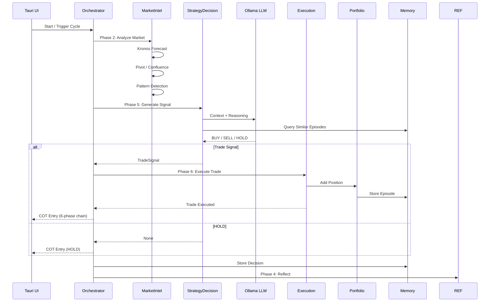
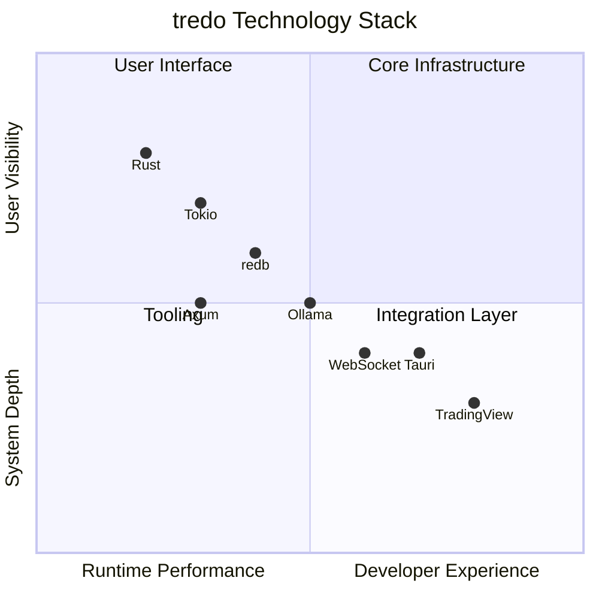

# ⚡ tredo — Trading Real-time Edge Decision Optimisation

**A production-grade, Rust-first autonomous agentic trading co-pilot.**

tredo combines a rigorous **Disciplined Core** (professional trading rules enforced in Rust), hierarchical multi-agent intelligence with structured debate, rich episodic memory with regret-driven reflection, and a powerful real-time Terminal UI.

- **Real-time paper trading validated** on live Binance data for crypto (BTC, ETH, SOL and more).
- **Self-evolving loop** demonstrated: debate + skills + trained memory → paper execution → reflection with regret scoring → meta rule adaptation.
- **Paper-first** until the full autonomous loop is solid and observable.

[](https://github.com/craaraju-ctrl/Tredo/actions/workflows/ci.yml)
[](https://www.rust-lang.org)
[](https://tokio.rs)
[](https://tauri.app)
[](LICENSE)

**Fresh TREDO repository** — complete rebrand and cleanup. All previous TREDO-era data, GitHub workflows, build artifacts, and historical databases have been removed for a clean starting point.

---

## Architecture Overview

tredo uses a **two-tier hierarchical architecture** with temporal loops and layered memory.

### Core Principles
- **Rules + Memory > Pure Prompting**: Deterministic professional trading rules (DisciplinedCore) live in Rust. Memory (local vector RAG + external agentmemory) grounds every decision.
- **Selective LLM**: Fast deterministic sub-agents handle most work. LLM is used sparingly and only after gates.
- **Full Observability**: Every decision produces rich Chain-of-Thought (COT) that is logged, visualised in the TUI, and used for reflection.
- **Self-Evolution**: High-regret outcomes trigger reflection → lessons → rule adaptation. The system measurably improves over time.

### System Layers

**UI Layer** (Primary: ratatui TUI, Secondary: Tauri)
- Real-time COT log, portfolio dashboard, agent tree, rules view, model selection, and watchlist.
- **Agent & Sub-Agent Tree**: Hierarchical tree view of all 16 sub-agents with color-coded action badges (🟢 PASS, 🔴 FAIL, 🟡 HOLD, 🔵 START), skill score bars with direction icons, confidence %, and live reasoning sub-lines.
- **Skill Consensus**: Aggregated signal header showing net score, conviction, bullish/bearish/neutral breakdown.
- Keyboard-driven (Tab/1-8/↑↓/q/Enter/r) for low-latency desk use.

**Orchestration Layer** (`tredo-orchestrator`)
- Fast loop (5s): Price updates + automatic SL/TP management in paper mode.
- Medium loop (5m): Full pipeline (Market Intelligence → Debate → Decision → Risk → Execution) with **per-sub-agent COT entry pushing** (16 sub-agents each log their action, confidence, and reasoning).
- Slow loop (24h or on-demand): Reflection + MetaControl rule adaptation.
- HTTP API: `/api/skills` for real-time skill votes + aggregated signal, `/api/agents` for hierarchy tree JSON.

**Agent Layer** (`tredo-autonomous`)
- **Identifier** group: Market scanning, intelligence, patterns, pivots, confluence, session timing, news analysis, market metrics (Bollinger, ATR, Stochastics, RSI, volume profile).
- **Verifier** group: Risk, psychology, reflection, drawdown monitoring, overtrading prevention.
- **Executer** group: Strategy decision (debate-driven), portfolio management, execution coordination (FSM-based).
- **Guardian** group: Drawdown monitoring, overtrading prevention, outcome logging.
- **MetaControl**: Learns from regret and mutates rules.

**Core Layer** (`tredo-core`)
- `DisciplinedCore`: Hard Rust gates (pivots, trend, confluence, position sizing, drawdown, session rules).
- `AgentSkill` trait: Pluggable deterministic capabilities (sentiment, volatility, regime, on-chain proxy, correlation, trained memory recall, news analysis, market metrics).
- Layered memory: redb (hot state), VectorMemory + embeddings (semantic recall), SQLite episode store (regret + history), agentmemory (long-term shared).
- LLM executor (Ollama primary, configurable via `LLM_MODEL` env var, default `nemotron-3-nano:4b`), Kronos client (forecast sidecar with graceful fallback), pattern detectors, paper execution engine.

**External Services**
- Live market data (Binance for crypto, Yahoo for stocks).
- Ollama (local LLM, model set via `LLM_MODEL=nemotron-3-nano:4b`).
- Kronos (time-series forecasting service).
- Optional agentmemory service for cross-session intelligence.

---

## Memory & Self-Evolution

tredo maintains three tiers of memory that feed directly into decision quality and long-term improvement:

1. **Hot operational state** — redb (portfolio, rules, recent decisions).
2. **Trained episodic memory** — Vector embeddings of past trades + outcomes for semantic recall ("what did I do last time in similar conditions?").
3. **Long-term reflective memory** — SQLite journal of every closed trade, regret score, lesson, and rule change. High-regret episodes are summarised and persisted to agentmemory for cross-run learning.

The self-evolving loop is closed and observable:
- Debate (with skills + memory recall) produces a decision.
- Paper execution records the outcome.
- Reflection scores regret and extracts lessons.
- MetaControl reviews regret clusters and applies rule changes (visible as `RULE_ADAPT` events in COT).
- Future cycles run under the improved rules and richer recalled context.

---

## Real-Time Paper Crypto Validation

The project ships with a powerful validation harness:

```bash
./tredo validate --extended --induce-regret
```

This runs the full autonomous system against **live Binance data** (no backtesting, no simulation), forces conditions that generate regret, and produces measurable self-evolution data (regret trends, rule tightening, COT evolution).

See `Build.md` for the complete guide on building, running, observing the self-evolving loop, and extending the system.

---

## Getting Started

1. Install prerequisites (Rust, optional Ollama + Kronos).
2. Copy the environment template and edit to your needs:
   ```bash
   cp config/tredo.env.example config/tredo.env
   ```
3. `./tredo build`
4. `./tredo setup` (creates config with `PAPER_MODE=true` by default).
5. `source config/tredo.env`
6. `./tredo tui` (primary interface) or `./tredo validate --extended` for automated real-time paper crypto testing.

Paper trading is the default and strongly recommended until you have extensive validated self-evolution data.

---

## Project Structure

- `crates/tredo-core` — Rules, memory, LLM client, paper engine, skills trait.
- `crates/tredo-autonomous` — Agent hierarchy, debate, reflection, meta-control, state.
- `crates/tredo-orchestrator` — Temporal loops and API server.
- `crates/tredo-tui` — Primary ratatui Terminal UI (Agent Tree, skill scores, COT log, color legend).
- `crates/tredo-orchestrator` — Temporal loops & API server (`/api/skills`, `/api/agents`).
- `src-tauri` — Secondary desktop UI (Tauri).
- `kronos_service` — Optional Python time-series forecast sidecar.

Full technical guide: [Build.md](Build.md)

---

## Status & Philosophy

The core "intact" self-evolving system (debate → realistic paper execution → reflection with regret → meta rule adaptation) has been validated with live data.

**Philosophy**: Professional trading discipline must be encoded in deterministic code and memory, not left to prompting. LLMs are powerful tools when used inside a strong, auditable, self-improving framework.

Paper trading + rigorous real-time validation only until the loop proves it compounds improvement over time.

---

## License

MIT. Use at your own risk. This is research and educational software. Paper trading only until you have thoroughly validated the autonomous loop on your own capital and risk parameters.



---

## 🎯 Core Philosophy

```
Rules + Memory > Pure Prompting
```

**Strong Skills + Rules + Roles + Trained Memory (the explicit design contract):**

- **Roles / Agents / Sub-Agents** already know *what to do* (their job in the Tredo hierarchy: Identifier, Verifier, Executer, Guardian + debate roles + main vs deterministic subs).
- **Skills** (via the `AgentSkill` trait in `tredo-core/src/skills.rs`) tell agents *how to do* things. Pluggable, executable capabilities (SentimentAnalyzer, VolatilityCalculator, TrainedMemorySkill, Regime, Patterns, etc.). Agents collect `Vec<Box<dyn AgentSkill>>` and execute them.
- **Rules** (`DisciplinedCore` + `apply_trained_memory_to_rules` in `tredo-core/src/disciplined_core.rs`) tell *what to do and what not to do* — hard non-negotiable gates (1% risk, 3% DD, pivots, confluence floors, red-folder, sessions...) that are dynamically strengthened by trained lessons.
- **Hierarchical Trained Memory** (RAG+ via `recall_trained_memory` in `SharedState` — local vector for recent episodes + agentmemory for long-term shared "trained intelligence") makes every agent and sub-agent *understand exactly what it was doing* in past similar situations, the real outcome, regret, and lesson. This grounds decisions, reduces hallucinations, and improves the system over time without bloating role code.

| Principle | Description |
|-----------|-------------|
| **Two-Tier Architecture** | Main Agents (LLM-capable) coordinate; Sub-Agents are deterministic and pure logic |
| **Disciplined Core First** | Non-negotiable trading rules enforced before any LLM call (now memory-adjusted) |
| **Skills as "How"** | Pluggable `AgentSkill` implementations for analysis, recall, and behavior |
| **Selective LLM Usage** | LLM is a scarce resource — only used for high-uncertainty or complex synthesis after debate + rules + memory |
| **Memory-Driven Self-Understanding** | Hierarchical trained recall (vector + agentmemory) so agents remember exactly what they did before and improve |
| **Observability** | Full chain-of-thought tree (tagged with skills/rules/trained), real-time dashboard, Tauri desktop UI |

---

## 🚀 Quick Start

```bash
# The one command that starts everything (hermes-style)
tredo                 # starts backend + (if TTY) can launch TUI
tredo tui             # the full beautiful Terminal UI (recommended primary interface)
tredo setup           # first time setup + build

# Or classic:
cargo run -p tredo-orchestrator
# Web UI (secondary): tredo ui   (serves the old Tauri static files on the API port)
```

Full Terminal UI is the star of tredo. The web frontend is kept for compatibility.

### 🔧 Prerequisites

| Dependency | Version | Purpose |
|------------|---------|---------|
| Rust | 1.75+ | Core language |
| Ollama | Latest | LLM inference (ministral-3) |
| Python 3 | 3.10+ | Kronos forecasting service |
| Node.js | 18+ | Tauri frontend tooling |

### 🔐 Environment Setup

Before running, create your `config/tredo.env` from the template:
```bash
cp config/tredo.env.example config/tredo.env
```

Then edit it with your API keys and preferences, and source it:
```bash
source config/tredo.env
```

The template documents every variable with comments. See `config/tredo.env.example` for details.

---

## 📦 Technology Stack



| Layer | Technology | Purpose |
|-------|-----------|---------|
| **Core Language** | Rust + Tokio | Async, safe, performant trading engine |
| **State & KV** | redb | Embedded key-value store for memory |
| **Vector Memory** | LanceDB | Semantic similarity for episode retrieval |
| **LLM** | Ollama (nemotron-3-nano:4b default, configurable via `LLM_MODEL`) | Selective reasoning + reflection |
| **Forecast** | Kronos (Python) | Time-series price prediction |
| **UI** | Tauri 2 + Vanilla JS | Native desktop SPA with 5 pages |
| **Charting** | TradingView / Canvas | Real-time market visualization |

---

## 🗂️ Project Structure

```
tredo/
├── crates/
│   ├── tredo-core/              # Foundation (Disciplined Core + apply_trained_memory, AgentSkill trait, hierarchical memory, LLM adapters, Kronos client)
│   ├── tredo-autonomous/        # Agent intelligence (Tredo hierarchy, full debate with skills+trained, skills impls, temporal loops, self-aware recall in main+subs)
│   ├── tredo-orchestrator/      # The autonomous brain + HTTP API (Fast/Med/Slow loops + WS broadcast)
│   └── tredo-tui/               # ★ Full Terminal UI (ratatui) — primary interface (COT, rules, memory views)
├── src-tauri/                   # Secondary web UI (Tauri + vanilla JS SPA)
├── kronos_service/              # Python time-series forecast (Chronos-Bolt)
├── docs/                        # Architecture docs (rebranded)
├── tredo                        # The hermes-style launcher (bash) — type `tredo` to start everything (setup wizard, multi-LLM, integrations)
├── Research.md + Build.md       # Deep research archive + executable build guide (skills/rules/trained memory emphasis)
└── README.md
```

---

## 🧪 Testing

```bash
# Core + agents
cargo test -p tredo-core -p tredo-autonomous

cargo test --workspace

# Full build (tredo-orchestrator + new tui)
cargo build --release -p tredo-orchestrator
cargo build -p tredo-tui
```

---

## ⚠️ Disclaimer

tredo is a **research and educational prototype** (paper trading only until perfect). It is **not financial advice**.

- Dummy API keys are in `crates/tredo-core/src/config.rs` — **replace before any real use**
- Extensive paper trading validation is required before real capital use
- Never commit real API keys — use environment variables or secure secret management in production

---

## 📚 Documentation

| Document | Description |
|----------|-------------|
| [Agent Architecture](docs/AGENT_DESIGN.md) | Tredo (four-group) hierarchy + debate + **Skills/Rules/Memory** contract |
| [Disciplined Core](docs/DISCIPLINED_CORE.md) | Non-negotiable rule engine (now with trained-memory adjustments) |
| [v2 Architecture](docs/AGENTIC_ARCHITECTURE_V2.md) | Loops + hierarchical trained memory + multi-agent debate + pluggable skills |
| [Low-Resource Design](docs/tredo_LOW_RESOURCE_ARCHITECTURE.md) | Efficient design notes (skills are lightweight) |
| [Roadmap](docs/ROADMAP.md) | Progress (Skills + Rules + Trained Memory layer complete) |
| [Kronos Service](kronos_service/README.md) | Forecast microservice |
| [Research](Research.md) + [Build](Build.md) | Full deep research + step-by-step build (including the "strong skills/rules" design) |
| [Test Runbook](test.md) | Comprehensive executable test plan for terminal (orchestrator + TUI) + desktop app (Tauri). Covers build/tests, services, full autonomous loops, COT, **Strong Skills + Rules + Trained Memory** verification, API/WS, safety gates, backtester, etc. |
