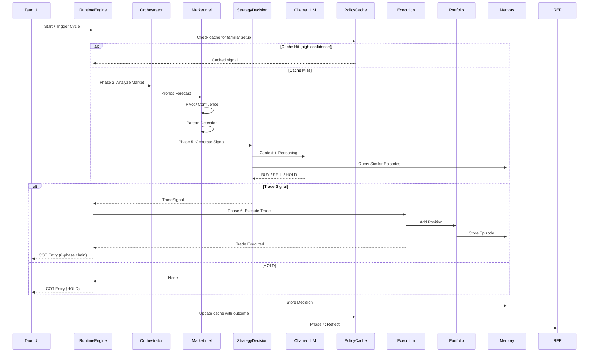
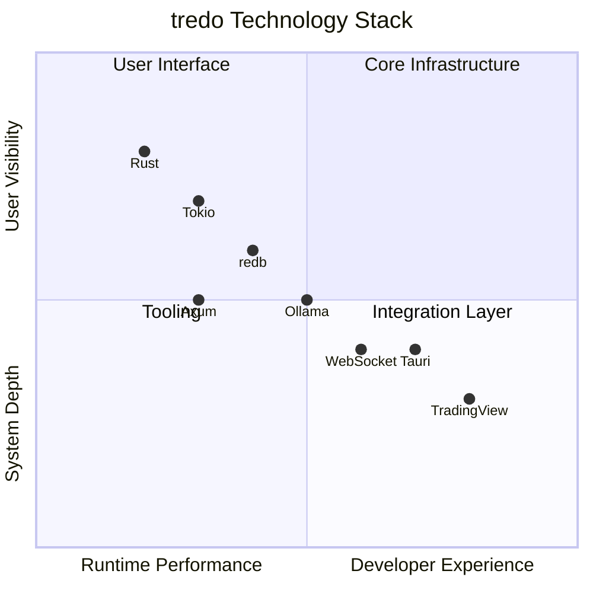

# ⚡ tredo — Trading Real-time Edge Decision Optimisation

**A production-grade, Rust-first autonomous agentic trading co-pilot.**

tredo combines a rigorous **Disciplined Core** (professional trading rules enforced in Rust), a **5-layer adversarial pipeline** (Hard Rules → Regime Detection → Multi-Agent Debate → Judge → Execution), rich episodic memory with regret-driven reflection, and a powerful real-time Terminal UI.

- **Real-time paper trading validated** on live Binance data for crypto (BTC, ETH, SOL and more).
- **Self-evolving loop** demonstrated: debate + skills + trained memory → paper execution → reflection with regret scoring → meta rule adaptation.
- **Paper-first** until the full autonomous loop is solid and observable.
- **5-layer adversarial pipeline** (`HardRulesGate` → `RegimeClassifier` → `DebateLayer` (BullTeam/BearTeam/Synthesizer) → `Judge` → `Execution`). No LLM dependency — all intelligence is evidence-based and regime-adaptive.
- **Unified runtime** (`tredo-runtime`) — event-driven, multi-mode (paper / live / backtest / validate / research), with a world model, policy cache, active learner, and broker plugin system.
- **Production broker adapters** — Alpaca (US equities/crypto) and Zerodha Kite Connect (India) with real API integration.

[](https://github.com/craaraju-ctrl/Tredo/actions/workflows/ci.yml)
[](https://www.rust-lang.org)
[](https://tokio.rs)
[](https://tauri.app)
[](LICENSE)
[](https://github.com/craaraju-ctrl/Tredo/blob/main/CONTRIBUTING.md#branching-strategy)

**Fresh TREDO repository** — complete rebrand and cleanup. All previous TREDO-era data, GitHub workflows, build artifacts, and historical databases have been removed for a clean starting point.

---

## Architecture Overview

tredo uses a **two-tier hierarchical architecture** with temporal loops, a unified event-driven runtime, and layered memory.

### Core Principles
- **Rules + Memory > Pure Prompting**: Deterministic professional trading rules (DisciplinedCore) live in Rust. Memory (local vector RAG + external agentmemory) grounds every decision.
- **Selective LLM**: Fast deterministic sub-agents handle most work. LLM is used sparingly and only after gates. The **Policy Cache** short-circuits expensive debate when the system has seen a similar setup before.
- **Full Observability**: Every decision produces rich Chain-of-Thought (COT) that is logged, visualised in the TUI, and used for reflection.
- **Self-Evolution**: High-regret outcomes trigger reflection → lessons → rule adaptation. The system measurably improves over time.
- **Multi-Mode Runtime**: The unified `RuntimeEngine` runs paper, live, backtest, validate, and research modes from the same agent core.

### System Layers

**UI Layer** (Primary: ratatui TUI, Secondary: Tauri)
- Real-time COT log, portfolio dashboard, agent tree, rules view, model selection, watchlist, backtest, health, performance, positions, and policy cache views.
- **Agent & Sub-Agent Tree**: Hierarchical tree view of all sub-agents with color-coded action badges (🟢 PASS, 🔴 FAIL, 🟡 HOLD, 🔵 START), skill score bars with direction icons, confidence %, and live reasoning sub-lines.
- **Skill Consensus**: Aggregated signal header showing net score, conviction, bullish/bearish/neutral breakdown.
- Keyboard-driven (Tab/1-8/↑↓/q/Enter/r/s/?) for low-latency desk use.

**Runtime Layer** (`tredo-runtime`) — *NEW: Unified Event-Driven Engine*
- `RuntimeEngine` — wires orchestrator, event bus, risk manager, introspector, goal manager, world model, portfolio reasoner, active learner, streaming reasoner, and policy cache.
- **Multi-mode**: `paper` (default), `live` (gated), `backtest`, `validate`, `research`.
- **Policy Cache** — learned (features → action → outcome) lookup table that reduces Ollama calls by short-circuiting debate on familiar setups.
- **World Model** — maintains beliefs about symbols, cross-symbol correlations, macro state, and active hypotheses.
- **Active Learner** — exploration budget for uncertain setups; probes and updates uncertainty map.
- **Broker Plugin System** — dispatches to `PaperBroker`, `AlpacaBroker`, or `ZerodhaKiteBroker` via `BrokerRegistry`.

**Orchestration Layer** (`tredo-orchestrator`)
- Fast loop (5s): Price updates + automatic SL/TP management in paper mode.
- Medium loop (5m): Full pipeline (Market Intelligence → Debate → Decision → Risk → Execution) with **per-sub-agent COT entry pushing**.
- Slow loop (24h or on-demand): Reflection + MetaControl rule adaptation.
- HTTP API: `/api/skills`, `/api/agents`, `/api/cot`, portfolio, rules, watchlist, models, backtest, health.
- WebSocket server for real-time TUI updates.

**Agent Layer** (`tredo-autonomous`)
- **5-Layer Pipeline Architecture** with priority-based conflict resolution:
  - **Layer 1: HardRulesGate** — Runs FIRST. Enforces ALL hard rules with priority-based blocking (Critical > High > Medium > Low). Critical/High always block. Medium blocks only if no Higher override. Low = warnings only.
  - **Layer 2: Identifier + Verifier** — Advisory only. Gathers market intelligence, risk analysis, confluence, pivots, patterns. Never blocks — the gate handled that.
  - **Layer 3: DebateLayer** — 6 advisory agents (BullTeam: 12 factors, BearTeam: 11 factors) provide evidence + confidence. No veto power.
  - **Layer 4: Judge/Adjudicator** — Evaluates debate quality ONLY (confidence, evidence contradiction, signal count). Does NOT re-run risk/regime/confluence checks.
  - **Layer 5: Execution** — Autonomous level computation, adaptive position sizing, trade execution.
- **Identifier** group: Market scanning, intelligence, patterns, pivots, confluence, session timing, news analysis, market metrics (RSI, MACD, ATR, Bollinger, Stochastic, OBV, ADX, CCI, Williams %R, VWAP).
- **Verifier** group: Risk psychology, risk calculator, reflection. Drawdown/overtrading checks delegated to HardRulesGate.
- **Executer** group: Strategy decision (debate-driven), portfolio management, execution coordination (FSM-based).
- **Guardian** group: Outcome logging. Drawdown/overtrading enforcement moved to HardRulesGate.
- **MetaControl**: Learns from regret and mutates rules.
- **New**: `DebateOrchestrator`, `AutonomousOrchestrator`, `OutcomeProcessor`, `RegimeClassifier`, `RiskGuardian`, `WalkForwardRunner`.

**Core Layer** (`tredo-core`)
- `DisciplinedCore`: Hard Rust gates (pivots, trend, confluence, position sizing, drawdown, session rules).
- `AgentSkill` trait: Pluggable deterministic capabilities (sentiment, volatility, regime, on-chain proxy, correlation, trained memory recall, news analysis, market metrics).
- **BrokerAdapter** trait: Unified interface for paper and live brokers (`AlpacaBroker`, `ZerodhaKiteBroker`).
- **Backtest engine**: CSV-driven backtest with realistic fills.
- Layered memory: redb (hot state), VectorMemory + embeddings (semantic recall), SQLite episode store (regret + history), agentmemory (long-term shared).
- LLM executor (Ollama primary, configurable via `LLM_MODEL` env var, default `nemotron-3-nano:4b`), Kronos client (forecast sidecar with graceful fallback), pattern detectors, paper execution engine.
- **New modules**: `broker.rs`, `backtest.rs`, `agent.rs`, `goals.rs`, `notifier.rs`, `role.rs`, `skill_aggregator.rs`.

**Broker Layer** (`tredo-broker-alpaca`, `tredo-broker-zerodha`)
- **Alpaca**: US equities + crypto, paper + live, API v2 (`/v2/account`, `/v2/orders`, `/v2/positions`).
- **Zerodha Kite Connect v3**: India equities + derivatives, OAuth2 flow, signed requests, holdings, positions, orders, margins.
- Both implement `BrokerAdapter` from `tredo-core`. Gated by `PAPER_MODE` and `--confirm-live`.

**External Services**
- Live market data (Binance for crypto, Yahoo for stocks).
- Ollama (local LLM, model set via `LLM_MODEL=nemotron-3-nano:4b`).
- Kronos (time-series forecasting service).
- Optional agentmemory service for cross-session intelligence.

---

## Memory & Self-Evolution

tredo maintains three tiers of memory that feed directly into decision quality and long-term improvement:

1. **Hot operational state** — redb (portfolio, rules, recent decisions).
2. **Trained episodic memory** — Vector embeddings of past trades + outcomes for semantic recall ("what did I do last time in similar conditions?").
3. **Long-term reflective memory** — SQLite journal of every closed trade, regret score, lesson, and rule change. High-regret episodes are summarised and persisted to agentmemory for cross-run learning.
4. **Policy Cache** — A learned lookup table of (market features → action → outcome) that short-circuits expensive debate when the system has seen a similar setup before. Seeded from historical trades, updated after every close.

The self-evolving loop is closed and observable:
- Debate (with skills + memory recall) produces a decision.
- Paper execution records the outcome.
- Reflection scores regret and extracts lessons.
- MetaControl reviews regret clusters and applies rule changes (visible as `RULE_ADAPT` events in COT).
- Policy Cache learns from outcomes to reduce future LLM calls.
- Future cycles run under the improved rules and richer recalled context.

---

## Real-Time Paper Crypto Validation

The project ships with a powerful validation harness:

```bash
tredo --mode validate --cycles 100 --induce-regret
```

This runs the full autonomous system against **live Binance data** (no backtesting, no simulation), forces conditions that generate regret, and produces measurable self-evolution data (regret trends, rule tightening, COT evolution).

See `Build.md` for the complete guide on building, running, observing the self-evolving loop, and extending the system.

---

## Getting Started

1. Install prerequisites (Rust, optional Ollama + Kronos).
2. Copy the environment template and edit to your needs:
   ```bash
   cp config/tredo.env.example config/tredo.env
   ```
3. `cargo build --workspace --release`
4. `tredo --mode paper` (starts the unified runtime in paper mode)
5. `tredo --mode validate --cycles 50` for automated real-time paper crypto testing.

Or use the legacy bash launcher (still present):
```bash
./tredo setup    # interactive wizard
./tredo tui      # start TUI (backend auto-starts)
```

Paper trading is the default and strongly recommended until you have extensive validated self-evolution data.

---

## Project Structure

```
tredo/
├── crates/
│   ├── tredo-core/              # Foundation (Disciplined Core, AgentSkill, memory, LLM, Kronos, broker trait, backtest)
│   ├── tredo-autonomous/        # Agent intelligence (hierarchy, debate, skills, reflection, meta, state, pipeline)
│   ├── tredo-orchestrator/      # Temporal loops + HTTP/WS API server
│   ├── tredo-tui/               # ★ Primary Terminal UI (ratatui) — COT, rules, memory, policy cache, backtest
│   ├── tredo-server/            # Production HTTP server (Axum + broker registry)
│   ├── tredo-runtime/           # ★ NEW: Unified runtime engine (event-driven, multi-mode, world model, policy cache, brokers)
│   ├── tredo-broker-alpaca/     # ★ NEW: Alpaca Markets API v2 broker adapter (US equities/crypto)
│   └── tredo-broker-zerodha/    # ★ NEW: Zerodha Kite Connect v3 broker adapter (India)
├── src-tauri/                   # Secondary desktop UI (Tauri + vanilla JS SPA)
├── kronos_service/              # Python time-series forecast sidecar (Chronos-Bolt)
├── docs/                        # Architecture docs
├── tredo                        # Legacy bash launcher (Hermes-style wizard)
└── README.md + Build.md
```

Full technical guide: [Build.md](Build.md)

---

## Status & Philosophy

The core "intact" self-evolving system (debate → realistic paper execution → reflection with regret → meta rule adaptation) has been validated with live data.

**New in this evolution:**
- **Unified Runtime** (`tredo-runtime`) replaces the ad-hoc pipeline with an event-driven, multi-mode engine.
- **Policy Cache** reduces LLM calls by learning from past (features → action → outcome) tuples.
- **World Model** maintains persistent beliefs about market state across symbols and regimes.
- **Real Broker Adapters** — Alpaca and Zerodha are production-ready implementations, not stubs.
- **Active Learner** — exploration budget for uncertain setups, updating uncertainty maps.

**Philosophy**: Professional trading discipline must be encoded in deterministic code and memory, not left to prompting. LLMs are powerful tools when used inside a strong, auditable, self-improving framework.

Paper trading + rigorous real-time validation only until the loop proves it compounds improvement over time.

---

## License

MIT. Use at your own risk. This is research and educational software. Paper trading only until you have thoroughly validated the autonomous loop on your own capital and risk parameters.



---

## 🎯 Core Philosophy

```
Rules + Memory > Pure Prompting
```

**Strong Skills + Rules + Roles + Trained Memory (the explicit design contract):**

- **Roles / Agents / Sub-Agents** already know *what to do* (their job in the Tredo hierarchy: Identifier, Verifier, Executer, Guardian + debate roles + main vs deterministic subs).
- **Skills** (via the `AgentSkill` trait in `tredo-core/src/skills.rs`) tell agents *how to do* things. Pluggable, executable capabilities (SentimentAnalyzer, VolatilityCalculator, TrainedMemorySkill, Regime, Patterns, etc.). Agents collect `Vec<Box<dyn AgentSkill>>` and execute them.
- **Rules** (`DisciplinedCore` + `apply_trained_memory_to_rules` in `tredo-core/src/disciplined_core.rs`) tell *what to do and what not to do* — hard non-negotiable gates (1% risk, 3% DD, pivots, confluence floors, red-folder, sessions...) that are dynamically strengthened by trained lessons.
- **Hierarchical Trained Memory** (RAG+ via `recall_trained_memory` in `SharedState` — local vector for recent episodes + agentmemory for long-term shared "trained intelligence") makes every agent and sub-agent *understand exactly what it was doing* in past similar situations, the real outcome, regret, and lesson. This grounds decisions, reduces hallucinations, and improves the system over time without bloating role code.
- **Policy Cache** (in `tredo-runtime`) records (features → action → outcome) tuples and short-circuits expensive debate when the system has seen a similar setup before. It's a learned lookup table, not a neural network — interpretable, self-improving, and honest about when it doesn't have enough data.

| Principle | Description |
|-----------|-------------|
| **Two-Tier Architecture** | Main Agents (LLM-capable) coordinate; Sub-Agents are deterministic and pure logic |
| **Disciplined Core First** | Non-negotiable trading rules enforced before any LLM call (now memory-adjusted) |
| **Skills as "How"** | Pluggable `AgentSkill` implementations for analysis, recall, and behavior |
| **Selective LLM Usage** | LLM is a scarce resource — only used for high-uncertainty or complex synthesis after debate + rules + memory + policy cache |
| **Memory-Driven Self-Understanding** | Hierarchical trained recall (vector + agentmemory) so agents remember exactly what they did before and improve |
| **Policy Cache** | Learned lookup table short-circuits debate on familiar setups, reducing cost and latency |
| **Observability** | Full chain-of-thought tree (tagged with skills/rules/trained/policy), real-time dashboard, Tauri desktop UI |

---

## 🚀 Quick Start

```bash
# The unified CLI (recommended)
cargo run -p tredo-runtime -- --mode paper

# Or after release build:
cargo build --workspace --release
./target/release/tredo --mode paper

# Primary TUI (connects to running backend)
tredo tui             # or: cargo run -p tredo-tui

# Validate with live paper crypto
tredo --mode validate --cycles 100 --induce-regret

# Backtest mode
tredo --mode backtest --data ./btc_2024.csv --capital 100000

# Live mode (requires --confirm-live and real broker keys)
tredo --mode live --confirm-live

# Broker configuration
tredo configure alpaca
tredo configure zerodha

# Or classic:
cargo run -p tredo-orchestrator
# Web UI (secondary): tredo ui   (serves the old Tauri static files on the API port)
```

Full Terminal UI is the star of tredo. The web frontend is kept for compatibility.

### 🔧 Prerequisites

| Dependency | Version | Purpose |
|------------|---------|---------|
| Rust | 1.75+ | Core language |
| Ollama | Latest | LLM inference (ministral-3) |
| Python 3 | 3.10+ | Kronos forecasting service |
| Node.js | 18+ | Tauri frontend tooling |

### 🔐 Environment Setup

Before running, create your `config/tredo.env` from the template:
```bash
cp config/tredo.env.example config/tredo.env
```

Then edit it with your API keys and preferences, and source it:
```bash
source config/tredo.env
```

The template documents every variable with comments. See `config/tredo.env.example` for details.

---

## 📦 Technology Stack



| Layer | Technology | Purpose |
|-------|-----------|---------|
| **Core Language** | Rust + Tokio | Async, safe, performant trading engine |
| **State & KV** | redb | Embedded key-value store for memory |
| **Vector Memory** | LanceDB | Semantic similarity for episode retrieval |
| **LLM** | Ollama (nemotron-3-nano:4b default, configurable via `LLM_MODEL`) | Selective reasoning + reflection |
| **Forecast** | Kronos (Python) | Time-series price prediction |
| **UI** | Tauri 2 + Vanilla JS | Native desktop SPA with 5 pages |
| **Charting** | TradingView / Canvas | Real-time market visualization |
| **Brokers** | Alpaca API v2, Zerodha Kite v3 | Live trading adapters |
| **CLI** | clap (Rust) | Unified multi-mode command interface |

---

## 🗂️ Project Structure

```
tredo/
├── crates/
│   ├── tredo-core/              # Foundation (Disciplined Core + apply_trained_memory, AgentSkill trait, hierarchical memory, LLM adapters, Kronos client, BrokerAdapter trait, backtest engine)
│   ├── tredo-autonomous/        # Agent intelligence (Tredo hierarchy, full debate with skills+trained, skills impls, temporal loops, self-aware recall in main+subs, new: DebateOrchestrator, OutcomeProcessor, RegimeClassifier, RiskGuardian, WalkForwardRunner)
│   ├── tredo-orchestrator/      # The autonomous brain + HTTP API (Fast/Med/Slow loops + WS broadcast)
│   ├── tredo-tui/               # ★ Full Terminal UI (ratatui) — primary interface (COT, rules, memory, policy cache, backtest, health, performance, positions, scanner)
│   ├── tredo-server/            # Production HTTP server (Axum, broker registry, paper/live mode switching)
│   ├── tredo-runtime/           # ★ Unified runtime engine (event-driven, multi-mode, world model, policy cache, active learner, broker plugin system, introspector, resilient pipeline)
│   ├── tredo-broker-alpaca/     # ★ Alpaca Markets API v2 adapter (US equities + crypto, paper + live)
│   └── tredo-broker-zerodha/    # ★ Zerodha Kite Connect v3 adapter (India equities + derivatives, OAuth2, signed requests)
├── src-tauri/                   # Secondary desktop UI (Tauri + vanilla JS SPA)
├── kronos_service/              # Python time-series forecast (Chronos-Bolt)
├── docs/                        # Architecture docs (rebranded)
├── tredo                        # Legacy bash launcher (Hermes-style wizard, still works)
├── Research.md + Build.md       # Deep research archive + executable build guide
└── README.md
```

---

## 🧪 Testing

```bash
# Core + agents
cargo test -p tredo-core -p tredo-autonomous

# Full workspace (including new runtime and broker crates)
cargo test --workspace

# Full release build (all crates)
cargo build --workspace --release

# Test broker adapters (paper mode)
cargo test -p tredo-broker-alpaca -p tredo-broker-zerodha
```

---

## ⚠️ Disclaimer

tredo is a **research and educational prototype** (paper trading only until perfect). It is **not financial advice**.

- Dummy API keys are in `crates/tredo-core/src/config.rs` — **replace before any real use**
- Extensive paper trading validation is required before real capital use
- Never commit real API keys — use environment variables or secure secret management in production
- Live mode requires `--confirm-live` flag and is gated behind `PAPER_MODE=false`

---

## 📚 Documentation

| Document | Description |
|----------|-------------|
| [Agent Architecture](docs/AGENT_DESIGN.md) | Tredo (four-group) hierarchy + debate + **Skills/Rules/Memory** contract |
| [Disciplined Core](docs/DISCIPLINED_CORE.md) | Non-negotiable rule engine (now with trained-memory adjustments) |
| [v2 Architecture](docs/AGENTIC_ARCHITECTURE_V2.md) | Loops + hierarchical trained memory + multi-agent debate + pluggable skills + runtime engine |
| [Low-Resource Design](docs/tredo_LOW_RESOURCE_ARCHITECTURE.md) | Efficient design notes (skills are lightweight, policy cache reduces LLM calls) |
| [Roadmap](docs/ROADMAP.md) | Progress (Runtime + Policy Cache + Broker Adapters + Skills/Rules/Trained Memory complete) |
| [Kronos Service](kronos_service/README.md) | Forecast microservice |
| [Research](Research.md) + [Build](Build.md) | Full deep research + step-by-step build (including the "strong skills/rules" design) |
| [Test Runbook](test.md) | Comprehensive executable test plan for terminal (orchestrator + TUI) + desktop app (Tauri). Covers build/tests, services, full autonomous loops, COT, **Strong Skills + Rules + Trained Memory** verification, API/WS, safety gates, backtester, etc. |
