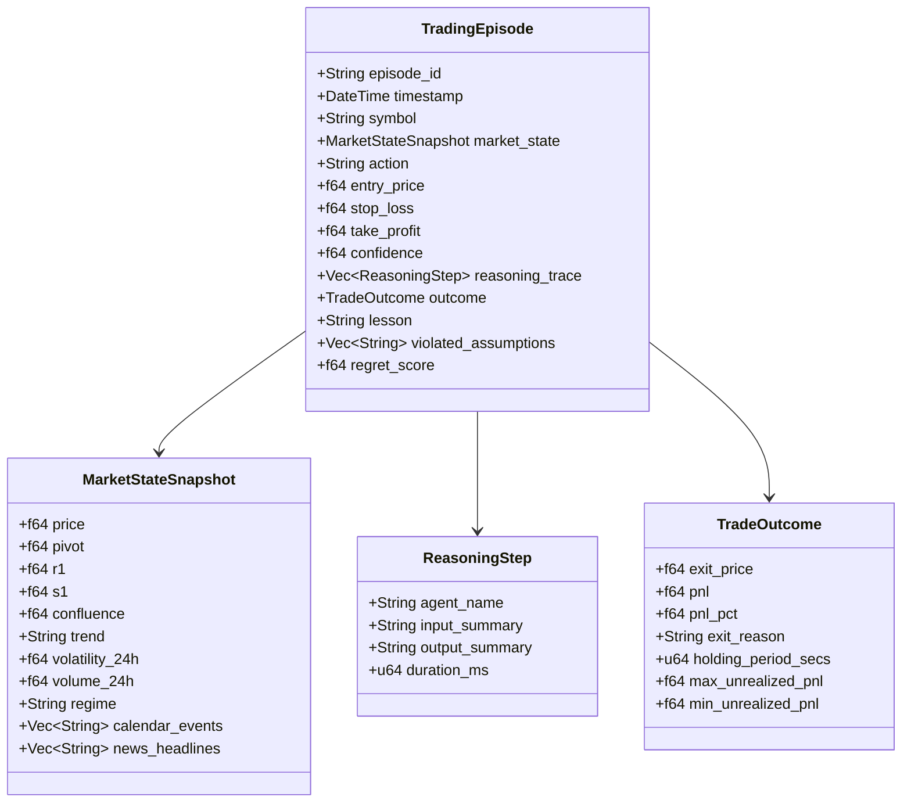
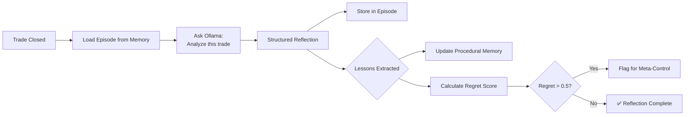
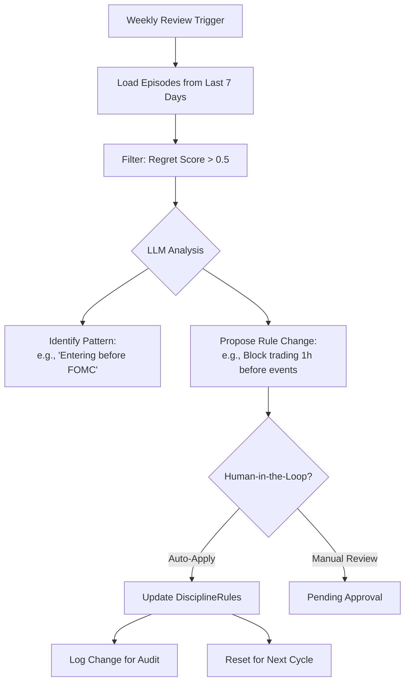
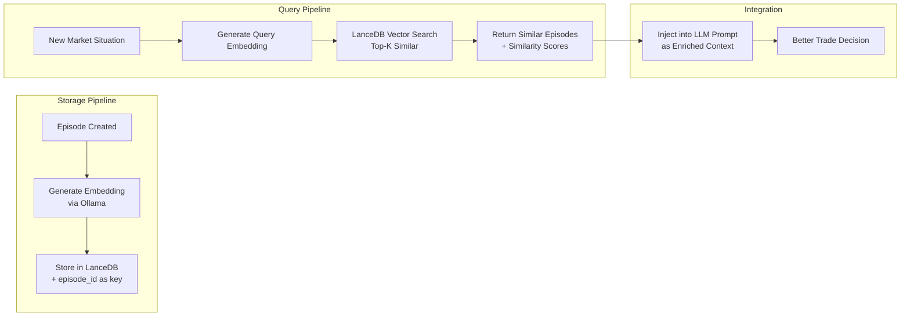
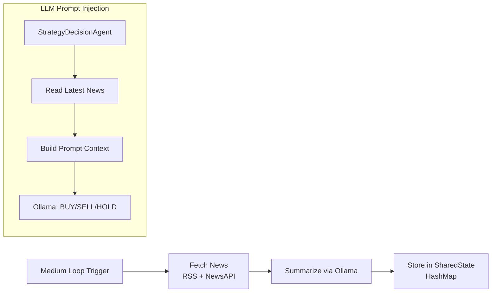
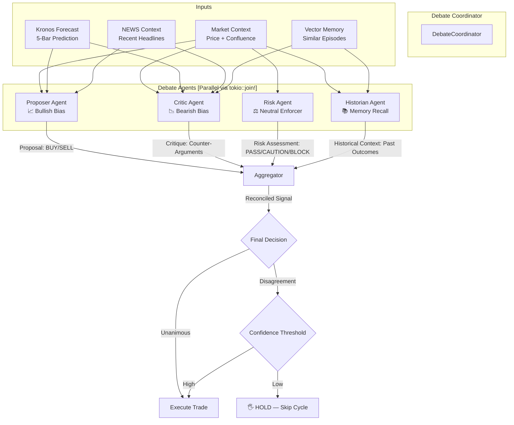
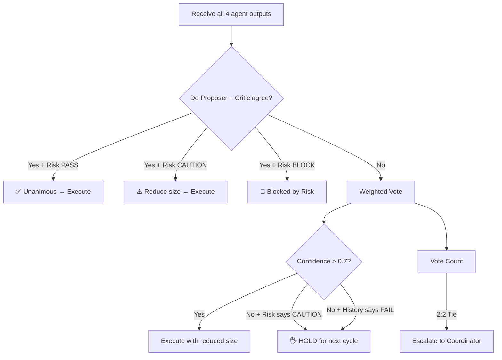

# 🧬 tredo Agentic Trading Architecture

**Goal:** A production-grade autonomous co-pilot with first-class Terminal UI. A self-improving agentic system built on debate, layered memory, temporal loops, and strict deterministic discipline.

---

## 📑 Table of Contents

1. [Current Architecture Limitations](#1-current-architecture-limitations)
2. [Target Architecture Overview](#2-target-architecture-overview)
3. [Phase A — Temporal Loops + Reflection + Meta-Control](#3-phase-a)
4. [Phase B — Vector Memory + News Integration](#4-phase-b)
5. [Phase C — Multi-Agent Debate Pipeline](#5-phase-c)
6. [Implementation Order](#6-implementation-order)
7. [Testing Strategy](#7-testing-strategy)

---

## 1. 🔴 Current Architecture Limitations

```mermaid
flowchart LR
    subgraph "Current 5-Second Flat Loop"
        PRICE[Price Refresh] --> PIPELINE[Pipeline<br/>(6 phases)]
        PIPELINE --> PORTFOLIO[Portfolio Snapshot]
        PORTFOLIO --> PRICE
    end
    
    style PRICE fill:#f66,color:#fff
    style PIPELINE fill:#f66,color:#fff
    style PORTFOLIO fill:#f66,color:#fff
```

### What it cannot do:

| Limitation | Impact | Severity |
|------------|--------|----------|
| ❌ No structured episode retrieval | Cannot learn from past mistakes | 🔴 Critical |
| ❌ No counterfactual reasoning | Enters similar bad setups repeatedly | 🔴 Critical |
| ❌ No self-rule adjustment | Rules remain static regardless of performance | 🟡 Major |
| ❌ No news/surprise integration | Missing fundamental context | 🟡 Major |
| ❌ Tactical = Strategic | All decisions at same cadence | 🟢 Minor |

---

## 2. 🎯 Target Architecture Overview

```mermaid
graph TB
    subgraph "RUNTIME LAYER (tredo-runtime)"
        RT[RuntimeEngine]
        WM[WorldModelEngine]
        PCACHE[PolicyCache]
        AL[ActiveLearner]
        INTRO[Introspector]
        GM[GoalManager]
        PR[PortfolioReasoner]
        SR[StreamingReasoner]
        BR[BrokerPluginManager]
        EB[EventBus]
    end

    subgraph "META-CONTROL LAYER [Slow Loop — 24h]"
        MC[MetaControl Agent]
        REVIEW[Weekly: Review Episodes]
        ANALYZE[Analyze High-Regret Patterns]
        PROPOSE[Propose Rule Changes]
    end

    subgraph "MEMORY LAYER"
        EPISODE[Episodic Store<br/>SQLite Database (WAL)]
        VECTOR[Vector Store<br/>LanceDB: embeddings + similarity]
        PROCEDURAL[Procedural Store<br/>accumulated lessons/rules]
        PCACHE2[Policy Cache<br/>learned features→action→outcome]
    end

    subgraph "REASONING LAYER [Medium Loop — 5m]"
        PRO[Proposer Agent<br/>Suggests trade]
        CRT[Critic Agent<br/>Challenges assumptions]
        RSK[Risk Agent<br/>Enforces limits]
        HIST[Historian Agent<br/>Retrieves past episodes]
        AGG[Aggregator<br/>Reconciles to single signal]
    end

    subgraph "PERCEPTION LAYER [Fast Loop — 5s]"
        PRICE[Price Feeds<br/>Binance WS + Yahoo]
        NEWS[News Fetcher<br/>RSS + API]
        PATTERN[Pattern Detector<br/>15 Candlestick Patterns]
        ANOMALY[Anomaly Detector<br/>Volume/Volatility Spikes]
    end

    subgraph "EXECUTION & BROKER LAYER"
        PAPER[PaperBroker<br/>Virtual trading]
        ALPACA[AlpacaBroker<br/>US equities/crypto]
        ZERODHA[ZerodhaKiteBroker<br/>India equities]
    end

    RT -->|orchestrates| ORCH
    RT -->|updates| WM
    RT -->|queries| PCACHE
    RT -->|dispatches trades| BR
    BR -->|paper| PAPER
    BR -->|live| ALPACA
    BR -->|live| ZERODHA

    MC -->|reads/writes| EPISODE
    MC -->|reads/writes| PROCEDURAL
    REVIEW --> ANALYZE
    ANALYZE --> PROPOSE
    PROPOSE --> MC

    PRO -->|queries| VECTOR
    CRT -->|queries| VECTOR
    HIST -->|queries| EPISODE
    HIST -->|queries| VECTOR
    PCACHE -->|short-circuits| PRO

    PRO --> AGG
    CRT --> AGG
    RSK --> AGG
    HIST --> AGG
    AGG -->|Final Signal| RT
    RT -->|Trade| BR

    Note: All debate participants + main agents also execute pluggable AgentSkills (how) and perform hierarchical trained memory recall (local vector + agentmemory) so they "understand exactly what they were doing" before. Rules (Disciplined Core) are applied with memory-based adjustments. Policy Cache short-circuits debate on familiar setups.

    PRICE --> PRO & CRT & RSK
    NEWS --> PRO
    PATTERN --> PRO
    ANOMALY --> RSK
    WM -->|beliefs| PRO & CRT & RSK
```

### Execution Loops (Temporal Hierarchy)

```mermaid
gantt
    title Temporal Loop Hierarchy
    dateFormat HH:mm:ss
    axisFormat %M m %S s

    section Fast Loop [5s]
    Price Refresh             :active, f1, 00:00:00, 5s
    SL/TP Monitoring          :active, f2, 00:00:00, 5s
    Unrealized P&L Update     :active, f3, 00:00:01, 4s

    section Medium Loop [5m]
    Full Pipeline (6 phases)  :active, m1, 00:00:00, 10s
    News Fetch + Inject        :active, m2, 00:00:10, 3s
    Pattern Detection           :active, m3, 00:00:13, 200ms
    Skills Execution + Trained Recall + Multi-Agent Debate :active, m4, 00:00:15, 10s
    (Proposer/Critic/Risk/Historian with AgentSkill "how" + hierarchical memory self-understanding + DisciplinedCore rules with memory adjustments)

    section Slow Loop [24h]
    Deep Reflection           :active, s1, 00:00:00, 30s
    Episode Review             :active, s2, 00:00:30, 20s
    Meta-Control Review       :active, s3, 00:00:50, 20s
```

Each loop runs as a separate `tokio::task` with its own cadence. Shared state is synchronized through `SharedState` (Arc-based and clone-safe).

---

## 3. ⚙️ Phase A — Temporal Loops + Reflection + Meta-Control

### 3.1 Hierarchical Temporal Loops

**What changes:** Restructure from a single 5-second loop into three independent `tokio::spawn` tasks with a shared graceful shutdown channel.

```rust
// ── Fast Loop (5s) ──────────────────────────────────────────────
async fn fast_loop(state: SharedState, shutdown: watch::Receiver<bool>) {
    loop {
        tokio::select! {
            _ = shutdown.changed() => break,
            _ = sleep(Duration::from_secs(5)) => {
                // Price refresh → OHLCV update → SL/TP check
            }
        }
    }
}

// ── Medium Loop (5m) ────────────────────────────────────────────
async fn medium_loop(orchestrator: AutonomousOrchestrator, shutdown: watch::Receiver<bool>) {
    loop {
        tokio::select! {
            _ = shutdown.changed() => break,
            _ = sleep(Duration::from_secs(300)) => {
                // Full pipeline + multi-agent debate + news fetch
            }
        }
    }
}

// ── Slow Loop (24h) ─────────────────────────────────────────────
async fn slow_loop(state: SharedState, shutdown: watch::Receiver<bool>) {
    loop {
        tokio::select! {
            _ = shutdown.changed() => break,
            _ = sleep(Duration::from_secs(86400)) => {
                // Deep reflection → episode analysis → meta-control
            }
        }
    }
}
```

### 3.2 Structured Episodic Memory



### 3.3 Post-Trade Deep Reflection



| Field | Type | Description |
|-------|------|-------------|
| `violated_assumptions` | `Vec<String>` | "Entered during low confluence", "Ignored resistance level" |
| `lesson` | `String` | "Wait for volume confirmation before entering breakouts" |
| `regret_score` | `f64` (0.0–1.0) | 0.0 = perfect trade, 1.0 = terrible mistake |
| `suggested_rule_change` | `Option<String>` | "Reduce max_risk_per_trade to 0.8% after 2 consecutive losses" |

### 3.4 Meta-Control Agent



#### Rule Change Proposal

```rust
#[derive(Debug, Clone, Serialize, Deserialize)]
pub struct RuleChangeProposal {
    pub timestamp: DateTime<Utc>,
    pub episode_count_reviewed: usize,
    pub high_regret_episodes: usize,
    pub proposed_rules: DisciplineRules,
    pub reasoning: String,
    pub applied: bool,
}

// Example LLM prompt for weekly review:
// "Given these {N} mistakes from the past week: [...]
//  What DisciplineRules should change?
//  Respond with JSON: { changed_rules: { max_risk_per_trade: 0.008, ... } }"
```

---

## 4. 🧠 Phase B — Vector Memory + News Integration

### 4.1 Vector Memory (LanceDB)



### 4.2 News Integration



### 4.3 Candlestick Pattern Detection

```mermaid
flowchart LR
    subgraph "Single-TF Detection"
        BARS_1M[1m OHLCV Bars] --> DETECT[detect_patterns()]
        DETECT --> PATTERNS_1M[Patterns: Bullish Engulfing, Doji...]
    end
    
    subgraph "Multi-TF Confirmation"
        BARS_15M[15m OHLCV Bars] --> DETECT_MTF[detect_patterns_multi_tf()]
        BARS_1H[1h OHLCV Bars] --> DETECT_MTF
        BARS_1D[1d OHLCV Bars] --> DETECT_MTF
        DETECT_MTF --> CONFIRMATION[Cross-TF Confirmation<br/>Strong / Moderate / Weak]
    end
    
    subgraph "LLM Injection"
        PATTERNS_1M --> FORMAT[format_patterns()]
        CONFIRMATION --> FORMAT_MTF[format_mtf_confirmation()]
        FORMAT --> COMBINED[Combined Patterns Context]
        FORMAT_MTF --> COMBINED
        COMBINED --> LLM_PROMPT[Injected into<br/>LLM Decision Prompt]
    end
```

#### Supported Patterns (15 Detectors)

| Pattern | Direction | Timeframes | Min Bars |
|---------|-----------|------------|----------|
| Doji | Neutral | All | 1 |
| Hammer | Bullish | All | 2 |
| Shooting Star | Bearish | All | 2 |
| Bullish Engulfing | Bullish | All | 2 |
| Bearish Engulfing | Bearish | All | 2 |
| Bullish Harami | Bullish | All | 2 |
| Bearish Harami | Bearish | All | 2 |
| Morning Star | Bullish | 1h, 1d | 3 |
| Evening Star | Bearish | 1h, 1d | 3 |
| Piercing Line | Bullish | All | 2 |
| Dark Cloud Cover | Bearish | All | 2 |
| Marubozu | Directional | All | 1 |
| Spinning Top | Neutral | All | 1 |
| Three White Soldiers | Bullish | 1h, 1d | 3 |
| Three Black Crows | Bearish | 1h, 1d | 3 |

---

## 5. 🗣️ Phase C — Multi-Agent Debate Pipeline

### 5.1 Debate Architecture



### 5.2 Agent Persona Prompts

**Proposer — The Bull:**
```
You are an experienced trader. Given current market data, suggest a trade.
Be specific with entry, SL, TP. Explain your reasoning concisely.
Focus on technical alignment and pattern confirmation.
```

**Critic — The Skeptic:**
```
You are a skeptical risk officer. Challenge the proposed trade.
What could go wrong? What hidden assumptions exist?
What would happen if the news surprises negatively?
```

**Risk — The Enforcer:**
```
You enforce hard risk limits. Check:
- Max position size vs equity
- Daily drawdown remaining
- Consecutive losses
- Current portfolio heat
Respond PASS / CAUTION / BLOCK with reason.
```

**Historian — The Archivist:**
```
You remember every past trade. Given the current situation, find the most
similar past trades and summarize their outcomes. Warn if the current
proposal resembles past failures with regret_score > 0.5.
```

### 5.3 Aggregator Logic



---

## 6. 📅 Implementation Order

### Phase A — Temporal Loops + Reflection (Weeks 1-2)

```mermaid
gantt
    title Phase A Implementation
    dateFormat  DD
    axisFormat  Day %d
    
    section Core Types
    Episode Types              :active, a1, 01, 02
    Memory Store Integration   :active, a2, 03, 02
    
    section Loops
    3 Temporal Loops           :active, a3, 05, 02
    Shutdown Channel           :active, a4, 06, 01
    
    section Intelligence
    Post-Trade Reflection      :active, a5, 07, 02
    MetaControl Agent          :active, a6, 09, 02
    
    section Testing
    Integration Tests          :active, a7, 11, 02
    Paper Trading Validation   :active, a8, 13, 02
```



### Phase B — Vector Memory + News (Weeks 3-5)

| Day | Task | Dependencies |
|-----|------|-------------|
| 15-17 | Add LanceDB, build VectorMemory | Phase A complete |
| 18-19 | Build embedding pipeline via Ollama | VectorMemory built |
| 20-21 | Integrate vector search into StrategyDecisionAgent | Embedding pipeline ready |
| 22-24 | Build NewsFetcher with RSS + API fallback | — |
| 25-26 | Build candlestick pattern detector | — |
| 27-28 | Wire news + patterns into perception layer | NewsFetcher + PatternDetector |
| 29-30 | Integration testing, tuning | All Phase B features |

### Phase C — Multi-Agent Debate (Weeks 6-8)

| Day | Task | Dependencies |
|-----|------|-------------|
| 31-33 | Build debate/ directory module structure | Phase B complete |
| 34-36 | Implement ProposerAgent + CriticAgent | Debate infrastructure |
| 37-38 | Implement RiskAgent + HistorianAgent | Proposer + Critic |
| 39-41 | Build Aggregator with conflict resolution | All 4 agents |
| 42-44 | Wire debate into medium loop, parallelize with `tokio::join!` | Aggregator |
| 45-47 | End-to-end testing, tuning prompts | All wired |
| 48-49 | Load testing (4× Ollama calls per cycle) | Tests passing |
| 50 | Final review, documentation | All phases |

---

## 7. 🧪 Testing Strategy

### Unit Tests

| Module | Tests | Description |
|--------|-------|-------------|
| `episode.rs` | Serialization roundtrip, regret score calculation | Verifies episode data integrity |
| `patterns.rs` | Pattern detection on known candlestick formations | 15 patterns × 4 timeframes |
| `news.rs` | RSS parsing, sentiment extraction | NewsItem structure validity |
| `vector_memory.rs` | Store + query similarity | Requires LanceDB running |
| `meta_control.rs` | Rule change proposal generation | Mock LLM responses |

### Integration Tests

| Test | Scenario | Pass Criteria |
|------|----------|--------------|
| `reflector.rs` | Mock LLM → structured reflection | All fields populated correctly |
| `debate/*.rs` | Each agent with mock inputs | Returns expected type |
| `debate/aggregator.rs` | Conflicting inputs | Produces reconciled output |
| `loops.rs` | All 3 loops via shutdown channel | Clean shutdown within 100ms |

### Paper Trading Validation

After each phase, run on paper mode for 48+ hours:

| Phase | Validation Criteria |
|-------|-------------------|
| **Phase A** | Episodes stored, reflections generated, rules auto-adjust |
| **Phase B** | Similar episodes retrieved and influence decisions, news in prompts |
| **Phase D** | Runtime engine cycles, policy cache learns, world model updates, broker adapters connect in paper | 4 LLM calls + cache short-circuits, debate reduces false positives, broker adapters tested |

```bash
# Unit + integration
cargo test -p tredo-core
cargo test -p tredo-autonomous

# Paper trading (legacy)
cargo run -p tredo-orchestrator
# Observe logs for episode creation, reflection, meta-control cycles

# Paper trading (new unified CLI — recommended)
cargo run -p tredo-runtime -- --mode paper
# or validate mode
cargo run -p tredo-runtime -- --mode validate --cycles 50
```

---

## 📊 Summary

| Dimension | Phase A | Phase B | Phase C | Phase D (Runtime) |
|-----------|---------|---------|---------|-------------------|
| **Core idea** | Learn from mistakes | Remember past situations | Debate before acting | Unified runtime + brokers |
| **Key addition** | Episodic memory + Meta-control | Vector DB + News + Patterns | Multi-agent debate | Runtime engine + Policy Cache + World Model + Broker Adapters |
| **New files** | 3 | 3 | 6 | 8+ |
| **Modified files** | 9 | 6 | 4 | 10+ |
| **Dependencies** | None | LanceDB, Arrow | None | clap, tokio-tungstenite, binance-rs |
| **LLM calls/cycle** | 0 (reflection = async) | +1 (news summary) | +4 (debate + aggregator) | +0–4 (cache short-circuits familiar setups) |
| **Risk** | 🟢 Low — self-contained | 🟡 Medium — new DB | 🔴 High — latency | 🟡 Medium — new runtime complexity |
