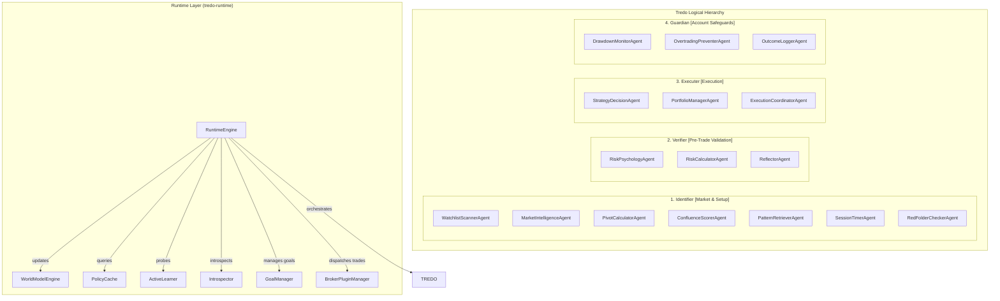
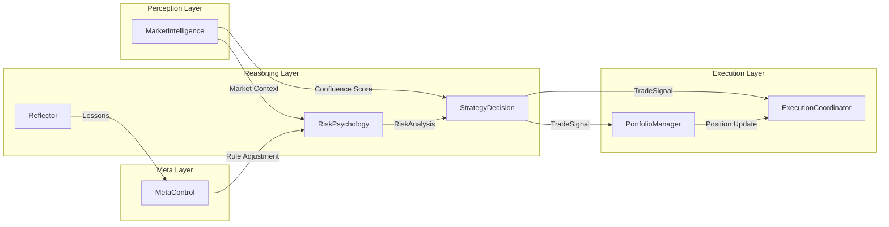
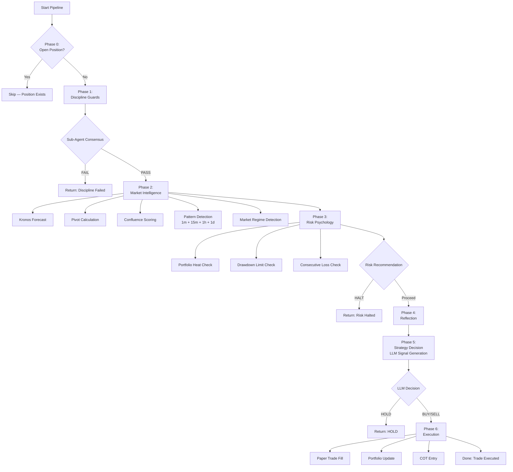

# 🧠 tredo Agent Design

**Trading Real-time Edge Decision Optimisation** — Full Terminal UI + Two-Tier Hierarchical Architecture.

Main agents orchestrate with LLM and structured debate. Sub-agents are fast, deterministic, and LLM-free for safety and performance.

---

## 🏗️ Agent Hierarchy & Logical Groups (Tredo)

tredo structures its agents into the **`Tredo`** four-group orchestrator (Identifier / Verifier / Executer / Guardian). The beautiful Terminal UI (`tredo tui`) is the primary way to watch and control the live system.

The **Runtime Engine** (`tredo-runtime`) wraps this hierarchy into an event-driven, multi-mode system with a world model, policy cache, and broker plugin system.

---

## 🧩 Main Agent Responsibilities

| Agent | Role | LLM Usage | Key Responsibilities |
|-------|------|-----------|---------------------|
| **MarketIntelligence** 🔍 | Data fusion & regime detection | Low–Medium | Confluence scoring, pivot calculation, Kronos forecast, candlestick pattern detection (15 patterns across 4 timeframes) |
| **StrategyDecision** 🤖 | Trade signal generation | Medium | LLM-driven BUY/SELL/HOLD with enriched context (Kronos forecast, calendar events, vector memory, news, multi-TF patterns) |
| **RiskPsychology** 🧠 | Risk management & discipline | Low | Position sizing, drawdown control, portfolio heat, psychology warnings (revenge trading, overtrading) |
| **Reflector** 💡 | Post-trade review & learning | Medium | Outcome analysis, violated assumptions, regret scoring, lesson extraction |
| **PortfolioManager** 📊 | Overall exposure & accounting | Low | LONG/SHORT accounting, cash balance management, position correlation |
| **ExecutionCoordinator** ⚡ | Final safety & paper execution | Very Low | Slippage check, liquidity check, kill-switch, SL/TP auto-exit |
| **MetaControl** 🔄 | Rule self-adjustment | Medium | Weekly review of high-regret episodes, LLM-proposed rule changes |

---

## ⚙️ Sub-Agent Specifications

All Sub-Agents are **deterministic, pure-logic** computations with no LLM dependency. They execute in milliseconds and form the backbone of the system's reliability.

### Technical Sub-Agents

| Sub-Agent | Input | Output | Algorithm |
|-----------|-------|--------|-----------|
| **PivotCalculator** | High, Low, Close | `PivotLevels { pivot, r1, r2, r3, s1, s2, s3 }` | Classic / Fibonacci / Woodie / Camarilla |
| **ConfluenceScorer** | MarketContext + PivotLevels | Score (0.0–1.0) | Multi-factor weighted sum: trend alignment, S/R proximity, volume confirmation, volatility |
| **SessionTimer** | Timestamp | `SessionInfo { open, name, time_remaining }` | IST-aware: London (13:30 IST) + NY (17:30 IST) |

### Risk Sub-Agents

| Sub-Agent | Input | Output | Algorithm |
|-----------|-------|--------|-----------|
| **PositionSizer** | Equity, Risk%, Entry, Stop | Position size (units) | `equity × risk% / |entry - stop|` |
| **DrawdownMonitor** | Daily P&L, Equity | Max drawdown %, HALT if exceeded | Track峰值 → trough, compare to max_daily_drawdown (3%) |

### Psychology Sub-Agents

| Sub-Agent | Input | Output | Algorithm |
|-----------|-------|--------|-----------|
| **RedFolderChecker** | Calendar events, Symbol | `bool` (blocked / allowed) | Matches symbol against high-impact events, synchronized to IST |
| **OvertradingPreventer** | Trade count, Max trades per day | `bool` (allowed / blocked) | `trade_count >= max_daily_trades → BLOCK` |

### Memory Sub-Agents

| Sub-Agent | Input | Output | Algorithm |
|-----------|-------|--------|-----------|
| **OutcomeLogger** | TradeSignal, Outcome | Stored episode | Writes structured `TradingEpisode` to redb + LanceDB |
| **PatternRetriever** | Current MarketContext | `Vec<PatternMatch>` | Searches historical episodes, ranks by similarity score |

---

## 🔄 Pipeline Phase Flow

---

## 🎭 Agent Personas

Each Main Agent is designed with a distinct **trading personality**:

| Agent | Persona | Voice |
|-------|---------|-------|
| **MarketIntelligence** | The Analyst | "Confluence is 0.72, pivot at 24,500 is holding. R1 at 24,620 would be my first target." |
| **StrategyDecision** | The Trader | "I'm seeing bullish engulfing on 1m with 75% strength. Kronos confirms upward drift. I'll take the long." |
| **RiskPsychology** | The Risk Officer | "Portfolio heat at 12%, DD at 1.2%, 3 consecutive losses. I'm recommending size reduction." |
| **Reflector** | The Mentor | "You entered during low confluence (0.35). Wait for confirmation next time. Regret score: 0.7." |
| **MetaControl** | The Coach | "Reviewing 12 episodes: 4 high-regret. Pattern: entering before FOMC. Adjusting max_risk_per_trade to 0.8%." |

---

## 💡 Design Rules

1. **Sub-Agents must be deterministic and fast** — they are the foundation of reliability
2. **Main Agents act as coordinators** — they delegate to Sub-Agents and synthesize results
3. **Most decisions should be resolved by Sub-Agents + Disciplined Core** — without invoking LLM
4. **LLM is only used when uncertainty is high or synthesis is complex** — it's a scarce resource
5. **Every decision must be auditable** — chain-of-thought entries capture the full reasoning path
6. **Agents should feel like specialized trading professionals** — not generic AI assistants

---

## 🛠️ Strong Skills + Rules + Roles + Trained Memory + Policy Cache (Explicit Contract)

Agents and sub-agents **already know what to do** (their Tredo role and responsibilities in the four groups and debate).

- **Skills** (`tredo-core/src/skills.rs` — the `AgentSkill` trait + `TrainedMemorySkill` + `SkillWrapper`) tell them **how to do** things. Pluggable and executable: SentimentAnalyzer, VolatilityCalculator, regime detection, patterns, and the key `TrainedMemorySkill`. Agents/sub-agents can hold or receive `Vec<Box<dyn AgentSkill>>` and call `execute`.
- **Rules** (`tredo-core/src/disciplined_core.rs`) tell **what to do and what not to do** (`DisciplineRules`, `validate_trade_setup`, `check_risk_limits`, etc.). These are now memory-aware via `apply_trained_memory_to_rules` (past regret/lessons can tighten confluence or risk limits dynamically).
- **Hierarchical Trained Memory** (`SharedState::recall_trained_memory`) is how agents and sub-agents **understand exactly what they were doing** before: combines fast local vector RAG (recent trained episodes with regret) + long-term `AgentMemoryClient` (shared "trained intelligence" lessons). Used in StrategyDecision, every debate participant (Proposer/Critic/Risk/Historian), MarketIntelligence, Reflector, MetaControl, and even subs (e.g. ConfluenceScorer). Results are injected into COT, reasoning, and rule adjustments. Tagged steps like "StrongRules+Skills+TrainedMemory".
- **Policy Cache** (`tredo-runtime/src/policy_cache.rs`) is the **learned trading memory** that records (market features → action → outcome) tuples and short-circuits expensive Ollama debate when the system has seen a similar setup before. It's a learned lookup table, not a neural network — interpretable, self-improving, and honest about when it doesn't have enough data. Seeded from historical trades on startup, updated after every close.
- **World Model** (`tredo-runtime/src/world_model.rs`) maintains persistent beliefs about symbols, cross-symbol correlations, macro state, and active hypotheses that ground decisions in a coherent market understanding.

This design keeps role code stable and focused while the skills layer provides composable "how", rules stay the iron constitution, trained memory supplies the experience that makes the team smarter, policy cache reduces cost and latency, and world model provides persistent market context. All wiring lives in `tredo-autonomous` (strategy_decision.rs, market_intelligence.rs, debate.rs, confluence_scorer.rs, etc.) and `tredo-runtime` (engine.rs, policy_cache.rs, world_model.rs). Lightweight and compatible with the low-resource target.

See also the Core Philosophy section in the root README and the dedicated sections in Research.md / Build.md.