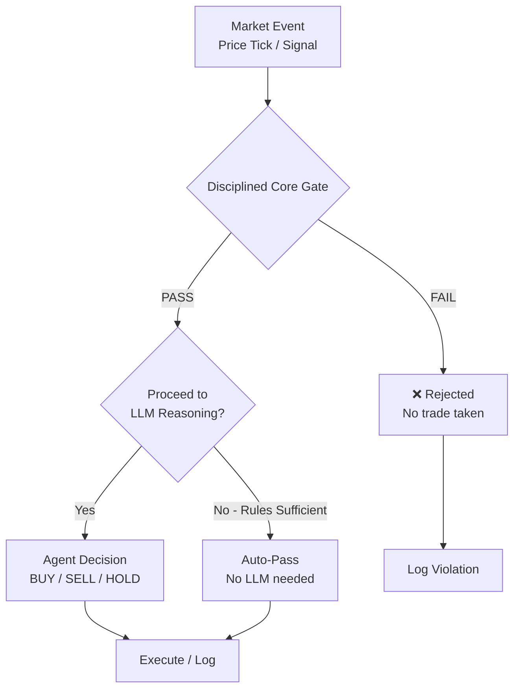
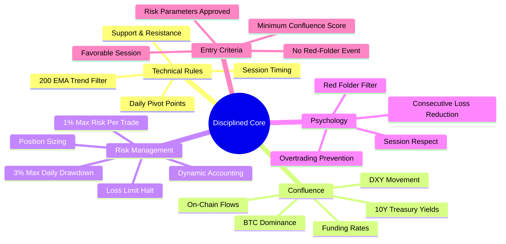
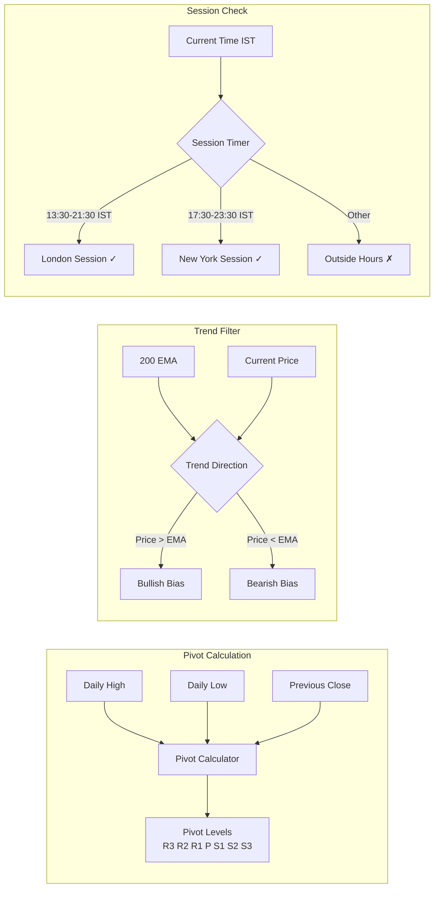
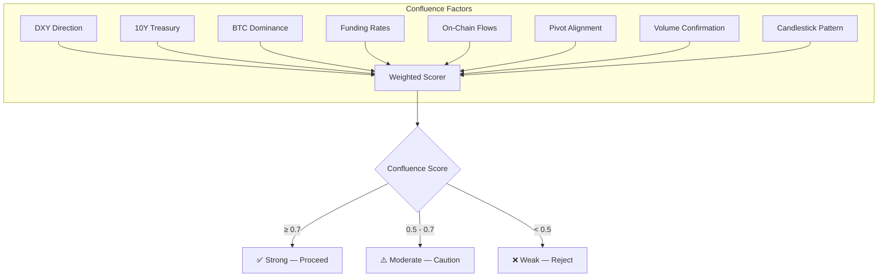
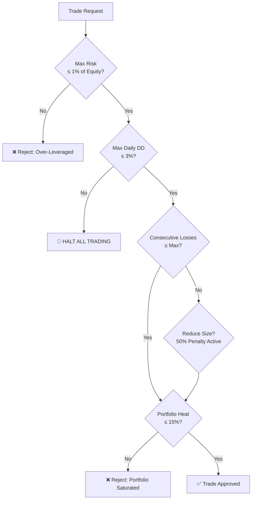
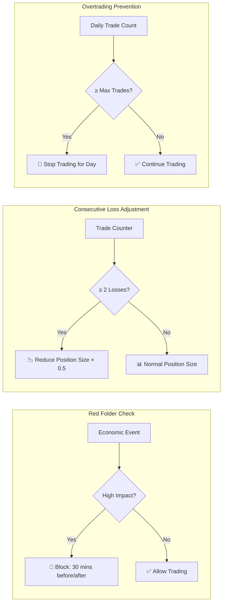
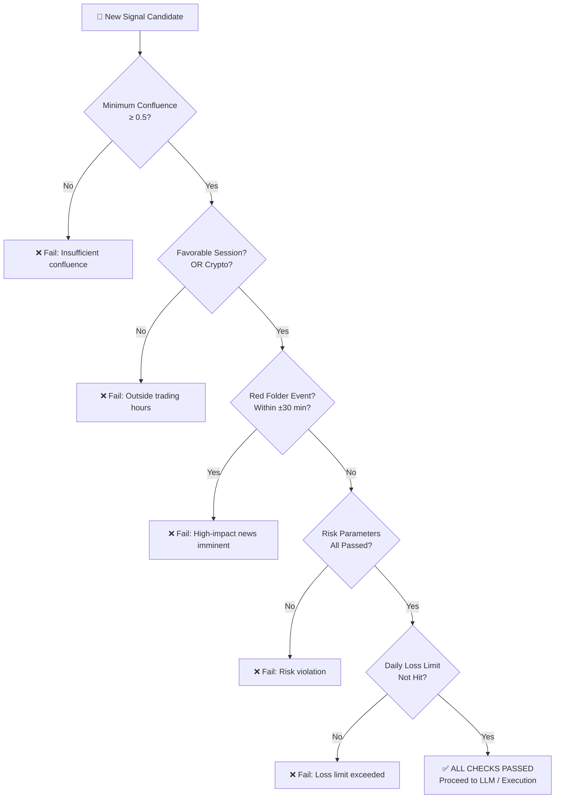

# 🛡️ tredo Disciplined Core Specification

> **The Non-Negotiable Foundation** (Trading Real-time Edge Decision Optimisation) — Professional rules in Rust. The Terminal UI surfaces violations clearly.



---

## 📋 Core Categories



---

## 1. 📐 Technical Rules



### Pivot Methods

| Method | Formula | Use Case |
|--------|---------|----------|
| **Classic** | `P = (H + L + C) / 3` | Default — general purpose |
| **Fibonacci** | `P = (H + L + C) / 3`, S/R via fib ratios | Trending markets |
| **Woodie** | `P = (H + L + 2C) / 4` | Momentum-driven |
| **Camarilla** | `P = (H + L + C) / 3`, tight S/R | Range-bound markets |

### Session Timing (IST)

| Session | Opens (IST) | Closes (IST) | Focus |
|---------|-------------|---------------|-------|
| London | 13:30 | 21:30 | European indices, FX majors |
| New York | 17:30 | 23:30 | US equities, NSE overlap |
| Asian | 05:30 | 13:30 | Crypto, JPY pairs |
| **Override** | Crypto (BTC/ETH/SOL) | **24/7** | Session check bypassed |

---

## 2. 🔗 Confluence Requirements

> Multiple factors must align before a trade is considered valid.



### Factor Weights

| Factor | Weight | Data Source |
|--------|--------|-------------|
| Pivot S/R Alignment | 0.25 | Pivot Calculator |
| Trend Filter | 0.20 | 200 EMA |
| Candlestick Pattern | 0.15 | 15 Detectors (1m, 15m, 1h, 1d) |
| Volume Confirmation | 0.10 | OHLCV Volume |
| Kronos Forecast | 0.10 | Time-Series Prediction |
| On-Chain Flows | 0.10 | Crypto-specific |
| News Sentiment | 0.10 | RSS Feeds / Summarized |

---

## 3. ⚠️ Risk Management (Hard Rules)

```
These rules are NON-NEGOTIABLE — they CANNOT be overridden by any agent.
```



| Rule | Limit | Enforcement | Behavior on Violation |
|------|-------|-------------|----------------------|
| Max Risk per Trade | 1% of equity | Per-trade sizing | Position size capped |
| Max Daily Drawdown | 3% of equity | Continuous monitor | 🛑 Halt all trading |
| Max Consecutive Losses | Configurable (default 3) | Per-trade counter | 50% size penalty, halt at limit |
| Max Portfolio Heat | 15% of equity | Continuous monitor | No new positions |
| Max Daily Trades | Configurable (default 10) | Daily counter | Block new trades |
| Min Confidence | Based on trading mode | Per-signal | HOLD if below threshold |

### Dynamic Accounting

```rust
// LONG position: P&L = (current_price - entry_price) * quantity
// SHORT position: P&L = (entry_price - current_price) * quantity
//
// Cash balance decreases on entry, increases on exit + P&L
// Equity = cash + sum of unrealized P&L across all open positions

// After SHORT sale:
// Cash += entry_price * quantity (proceeds from sale)
// Position liability = quantity shares at current price

// After SHORT close:
// Cash -= exit_price * quantity (buy back)
// P&L = entry_price * quantity - exit_price * quantity
```

---

## 4. 🧠 Psychology & Discipline



| Psych Rule | Trigger | Response | Duration |
|------------|---------|----------|----------|
| Red Folder Filter | High-impact economic event | Block trades ±30 minutes | 1 hour per event |
| Consecutive Loss Reduction | 2+ losses in a row | Reduce position size by 50% | Until a winning trade |
| Consecutive Loss Halt | Losses exceed max threshold | Halt all trading | End of day |
| Overtrading Prevention | Trades exceed max daily count | Block new trades | End of day |
| Mode-Based Confidence | Trading mode changed | Adjust min confidence threshold | Until mode changes |

---

## 5. ✅ Entry Criteria



### Checklist for a Valid Trade

```
[✅] Confluence Score ≥ Minimum Threshold
[✅] Within Valid Trading Session (London/NY) OR Crypto
[✅] No Red-Folder High-Impact Event ±30 minutes
[✅] Max Risk ≤ 1% of Account Equity
[✅] Max Daily Drawdown ≤ 3%
[✅] Not in Consecutive Loss Halt State
[✅] Portfolio Heat ≤ 15%
[✅] Trades Today ≤ Max Daily Trades
[✅] Position Sizing Correct (based on stop distance)
[✅] Entry Criteria Met (direction, SL/TP, confidence)
```

---

## 🏗️ Implementation Principles

```rust
// Written in Rust for speed and reliability
// Loaded at startup — zero runtime overhead
// Sub-Agents can make many decisions using only this core
// Main Agents consult it before using LLM

pub fn validate_trade_setup(context: &MarketContext, rules: &DisciplineRules) -> DisciplineResult {
    let mut all_reasons = Vec::new();
    let mut overall_passed = true;

    // 1. Session check (with crypto bypass)
    if !is_crypto && !is_in_trading_session(context.timestamp, rules) {
        all_reasons.push("Outside allowed trading sessions".to_string());
        overall_passed = false;
    }

    // 2. Confluence check
    let confluence = calculate_confluence_score(context, &pivots);
    if confluence < rules.min_confluence {
        all_reasons.push(format!("Confluence too low: {:.2}", confluence));
        overall_passed = false;
    }

    // 3. Risk checks
    if context.daily_pnl.abs() >= rules.max_daily_drawdown * context.total_equity {
        all_reasons.push("Daily drawdown limit reached".to_string());
        overall_passed = false;
    }

    // ... additional checks

    DisciplineResult { passed: overall_passed, reasons: all_reasons }
}
```

---

## 🎯 Goal

> Create agents that behave like **experienced, disciplined traders** who follow rules first and use intelligence second.

### Skills + Rules + Trained Memory Integration

The Disciplined Core is the **"what to do / what not to do"** layer (hard, fast, in Rust, non-overridable by LLM).

It is complemented by:
- **Skills** (`AgentSkill` trait): the "how" (pluggable analyzers and tools that agents execute to gather richer signals before rules are even consulted).
- **Trained memory adjustments**: `apply_trained_memory_to_rules(rules, recall)` in this module dynamically strengthens the rules (e.g. raises `min_confluence_score` or lowers `max_risk_per_trade`) when hierarchical recall surfaces past regret or cautionary lessons on similar setups. This is called from `StrategyDecisionAgent` (and can be used anywhere) right before debate/LLM.

Result: rules evolve safely with real experience ("trained intelligence") while remaining the single source of truth for safety. Sub-agents and main agents stay aware via `recall_trained_memory`. Full details and the exact philosophy ("skills tell how, rules tell what/not, agents already know their roles") are in `tredo-core/src/skills.rs` (header), `disciplined_core.rs`, and the agent files that call them.
