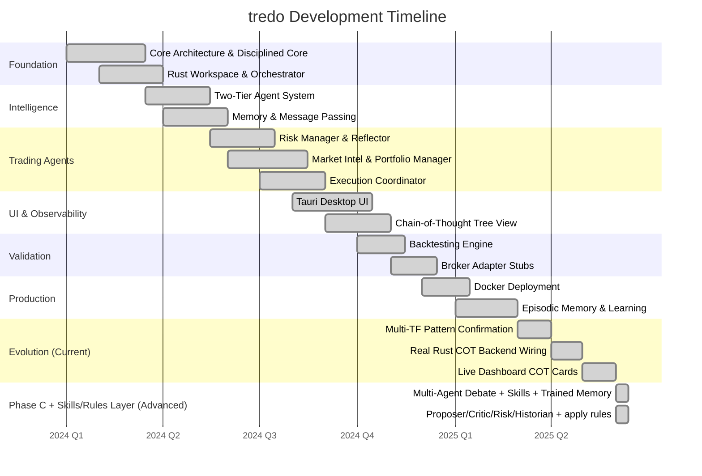
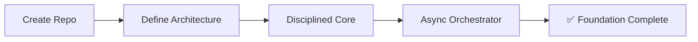
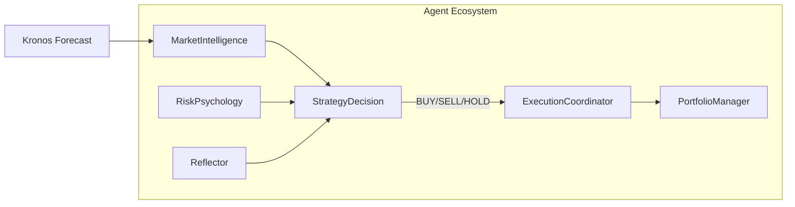
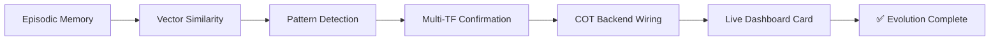
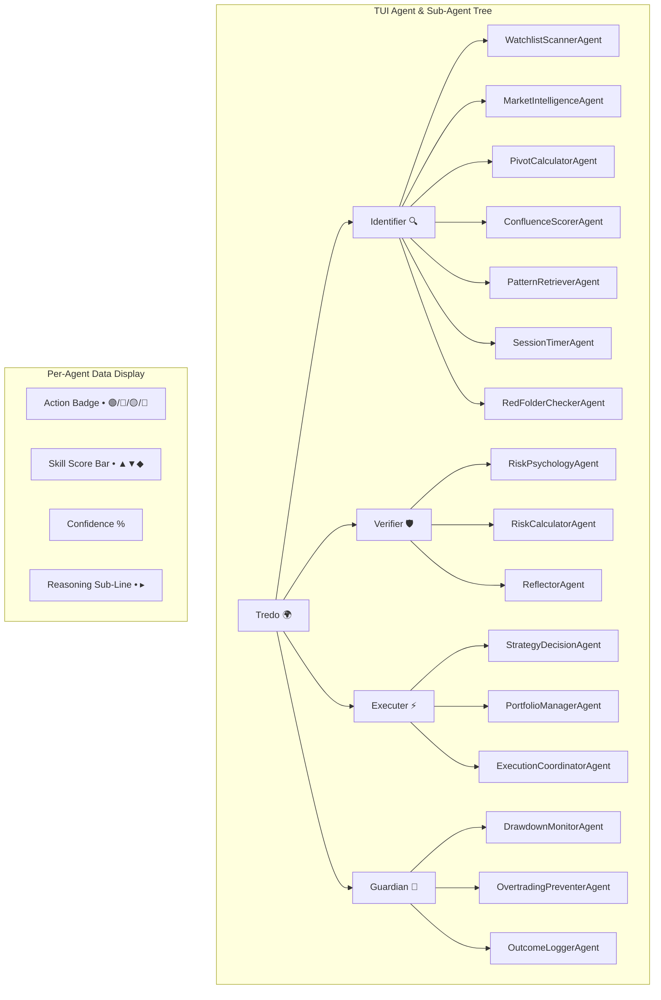

# 🗺️ tredo Development Roadmap

**Trading Real-time Edge Decision Optimisation** — From foundation to a production-grade autonomous co-pilot with first-class Terminal UI.

This roadmap reflects the current validated state of the system (real-time paper crypto, intact self-evolving loop) and remaining high-priority work.

---

## 📈 Overall Progress



---

## ✅ Phase 1: Foundation — Complete

> Building the core infrastructure and non-negotiable trading rules.

```
██████████████████████████████████████████████████ 100%
```

| Milestone | Status | Description |
|-----------|--------|-------------|
| Clean Rust repository | ✅ Done | Workspace with `tredo-core`, `tredo-autonomous`, `tredo-orchestrator` crates |
| Low-resource architecture | ✅ Done | 8GB RAM optimized, minimal LLM dependency |
| Disciplined Core in Rust | ✅ Done | Pivots, confluence, risk limits, session timing |
| Async Orchestrator | ✅ Done | Tokio-based orchestration with Fast/Medium/Slow loops |



---

## ✅ Phase 2: Core Intelligence — Complete

> Implementing the two-tier agent architecture and memory system.

```
██████████████████████████████████████████████████ 100%
```

| Milestone | Status | Description |
|-----------|--------|-------------|
| Full Disciplined Core | ✅ Done | All trading rules encoded in Rust |
| Two-Tier Agent System | ✅ Done | 7 Main Agents + 8 Sub-Agents |
| Memory System (redb) | ✅ Done | Embedded KV store for decisions and episodes |
| Async Message Passing | ✅ Done | Agent communication via Arc<RwLock> + tokio |

---

## ✅ Phase 3: Trading Agents — Complete

> Building specialized agent personalities for each trading function.

```
██████████████████████████████████████████████████ 100%
```



| Agent | Status | Key Capabilities |
|-------|--------|------------------|
| Market Intelligence | ✅ Done | Kronos forecast, pivot/confluence, pattern detection, multi-TF |
| Strategy Decision | ✅ Done | LLM-driven signal generation with enriched context |
| Risk Psychology | ✅ Done | Portfolio heat, drawdown, consecutive loss checks |
| Reflector | ✅ Done | Post-trade analysis, lesson extraction, regret scoring |
| Portfolio Manager | ✅ Done | LONG/SHORT accounting, position sizing |
| Execution Coordinator | ✅ Done | Paper trading, SL/TP auto-exit |

---

## ✅ Phase 4: Observability & Control — Complete

> Building the desktop UI for real-time monitoring and control.

```
██████████████████████████████████████████████████ 100%
```

| Milestone | Status | Description |
|-----------|--------|-------------|
| Tauri Desktop UI | ✅ Done | 5-page SPA: Dashboard, Trading, AI Results, Analysis, Settings |
| Chain-of-Thought Tree | ✅ Done | Hierarchical reasoning tree with expand/collapse |
| Real-time COT Updates | ✅ Done | 3-second polling from Rust backend via Tauri IPC |
| Live Dashboard Card | ✅ Done | Latest AI decision card with real-time updates |

---

## ✅ Phase 5: Backtesting & Validation — Complete

> Validating the system against historical data.

```
██████████████████████████████████████████████████ 100%
```

| Milestone | Status | Description |
|-----------|--------|-------------|
| Historical Simulation | ✅ Done | 50-cycle backtester with OHLCV data |
| Performance Metrics | ✅ Done | Win rate, P&L, max drawdown, Sharpe ratio |

---

## ✅ Phase 6: Execution & Safety — Complete

> Adding safety layers and broker integration stubs.

```
██████████████████████████████████████████████████ 100%
```

| Milestone | Status | Description |
|-----------|--------|-------------|
| Broker Adapter Stubs | ✅ Done | Kite/Zerodha dummy keys |
| Multi-Layer Risk Checks | ✅ Done | Position size, drawdown, heat, consecutive losses |
| Kill Switches | ✅ Done | Circuit breakers at agent and system level |

---

## ✅ Phase 7: Production — Complete

> Optimizing for production deployment.

```
██████████████████████████████████████████████████ 100%
```

| Milestone | Status | Description |
|-----------|--------|-------------|
| Docker Deployment | ✅ Done | Multi-stage Dockerfile for 8GB RAM |
| Resource Optimization | ✅ Done | Compiled binary, no runtime deps beyond Ollama |

---

## ✅ Phase 8: Evolution (Current) — Complete

> Adding self-learning, pattern detection, and live UI integration.

```
██████████████████████████████████████████████████ 100%
```



| Milestone | Status | Description |
|-----------|--------|-------------|
| Outcome Logging | ✅ Done | Structured episodes stored in redb |
| Self-Reflection | ✅ Done | Reflector agent with regret scoring |
| Meta-Control | ✅ Done | Weekly rule adjustment via LLM |
| Multi-TF Patterns | ✅ Done | 15 detectors across 4 timeframes |
| Real COT Backend | ✅ Done | Rust agents push to tree view via Tauri IPC |
| Live Dashboard Card | ✅ Done | Most recent AI decision shown on dashboard |

---

## 🔮 Phase C: Multi-Agent Debate + Skills/Rules/Trained Memory + TUI — Complete

> Full multi-agent debate (Proposer/Critic/Risk/Historian + aggregator) wired with pluggable skills and hierarchical trained memory. Strong explicit "skills tell how / rules tell what-not / agents know roles + memory makes them self-aware" layer implemented across the system. TUI now has hierarchical Agent & Sub-Agent Tree with skill scores and color legend.

```
████████████████████████████████████████ 100%
```

| Milestone | Status | Description |
|-----------|--------|-------------|
| Debate Coordinator + run_debate | ✅ Done | Orchestrates the 4 participants and weighted aggregator |
| Proposer / Critic / Risk / Historian | ✅ Done | All use skills (sentiment/vol/regime/corr) + `recall_trained_memory`; Historian pulls vector + agentmemory |
| Skills Layer (AgentSkill trait) | ✅ Done | `tredo-core/src/skills.rs`: trait + TrainedMemorySkill + impls for SentimentAnalyzer, VolatilityCalculator, NewsAnalyser, MarketMetricsMeter |
| Rules + Trained Memory Adjustments | ✅ Done | `apply_trained_memory_to_rules` in DisciplinedCore; called in StrategyDecision before debate |
| Hierarchical Trained Memory Everywhere | ✅ Done | `recall_trained_memory` (vector RAG + agentmemory long-term) injected in SD, MI, all debate roles, Reflector, MetaControl, ConfluenceScorer (sub) etc. COT tags "StrongRules+Skills+TrainedMemory" |
| Aggregator + Confidence | ✅ Done | Uses trained intel, risk veto, debate scores; prefers debate over raw LLM when confident |
| **Agent & Sub-Agent Tree in TUI** | ✅ Done | Hierarchical tree with Unicode box-draw connectors showing all 16 sub-agents with color-coded action badges, skill score bars, direction icons, confidence %, and reasoning sub-lines |
| **Per-Sub-Agent COT Entries** | ✅ Done | Each sub-agent pushes COT entries during pipeline runs (chain_id tracked) |
| **Skill Scores API** | ✅ Done | `/api/skills` endpoint returning skill votes + aggregated signal for TUI display |
| **TUI Color Legend** | ✅ Done | Key showing all action badge colors and score symbols at bottom of Agent Tree tab |
| **TUI API Fixes** | ✅ Done | Fixed double `/api/` prefix in all 7 endpoint URLs, fixed `unwrap_or_default()` on reqwest client builder |

The strong skills + rules contract (agents/sub-agents already know their jobs; skills = how; rules = what/not; trained memory = self-understanding + long-term improvement) is now the explicit design with full TUI observability. Phase C is complete.

### TUI Agent Tree Architecture



---

## 📊 Summary

| Phase | Status | Key Deliverables | Timeline |
|-------|--------|-----------------|----------|
| 1: Foundation | ✅ Complete | Rust workspace, Disciplined Core, Async Orchestrator | Q1 2024 |
| 2: Core Intelligence | ✅ Complete | Two-Tier Agents, Memory, Message Passing | Q2 2024 |
| 3: Trading Agents | ✅ Complete | 7 Main Agents + 8 Sub-Agents with LLM integration | Q3 2024 |
| 4: Observability | ✅ Complete | Tauri Desktop UI, COT Tree View | Q4 2024 |
| 5: Validation | ✅ Complete | Backtesting Engine, Performance Metrics | Q4 2024 |
| 6: Safety | ✅ Complete | Broker Adapters, Kill Switches | Q1 2025 |
| 7: Production | ✅ Complete | Docker Deployment, 8GB RAM Optimization | Q1 2025 |
| 8: Evolution | ✅ Complete | Episodic Memory, Patterns, Live COT UI | Q2 2025 |
| C: Debate + Skills/Rules + TUI | ✅ Complete (100%) | Full debate + Strong Skills (AgentSkill) + Rules (memory-adjusted) + Hierarchical Trained Memory (self-understanding in all agents + subs) + TUI Agent Tree with skill scores + per-sub-agent COT | 2026-06-15 |

> **Goal:** A stable, low-resource, high-discipline autonomous trading system that feels like a professional trading team.
