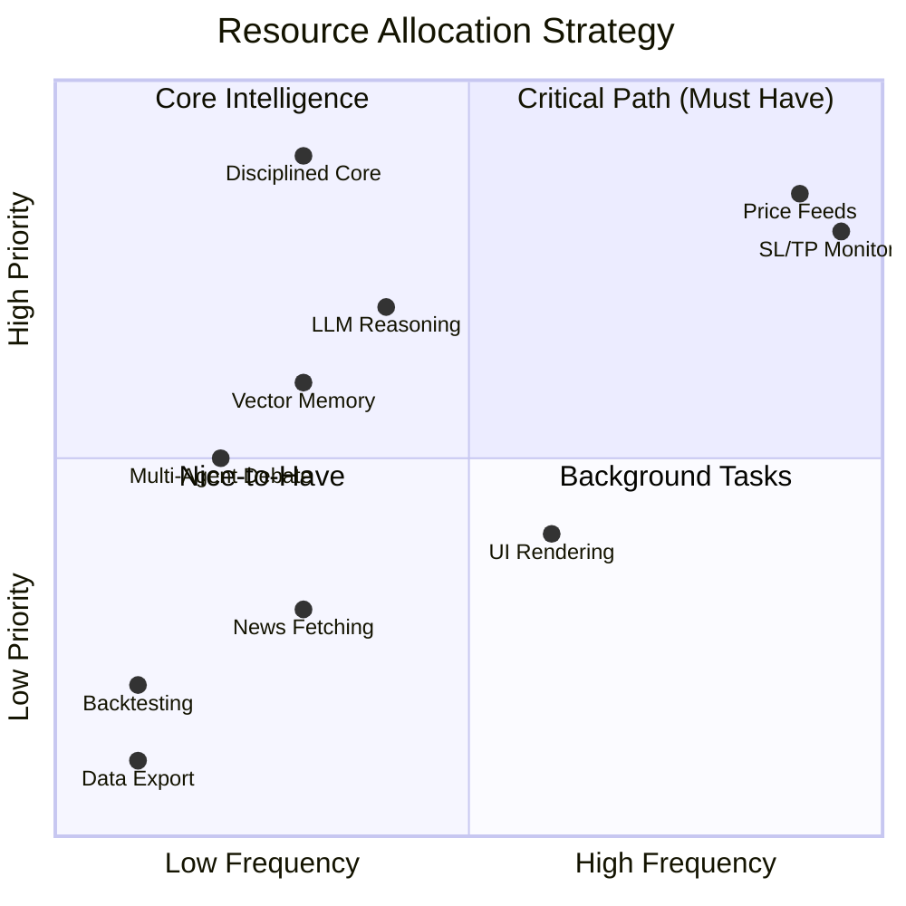
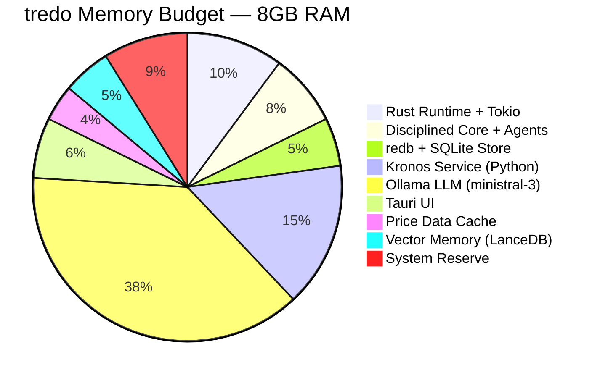
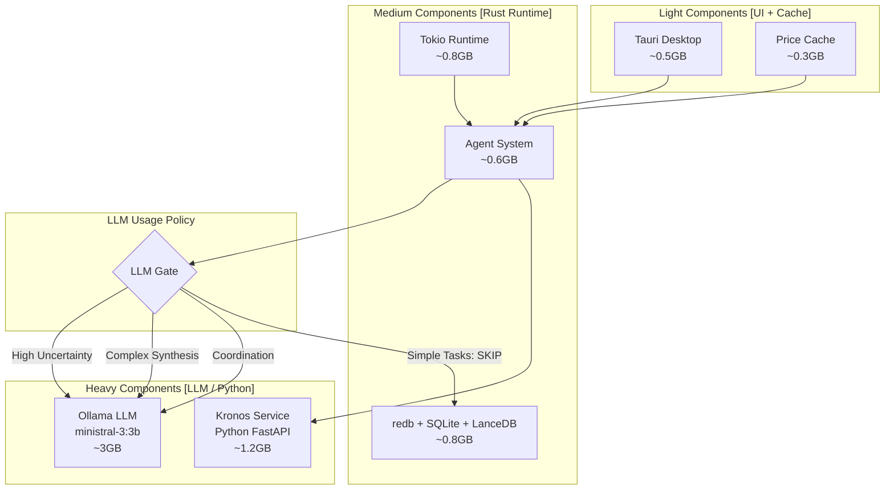
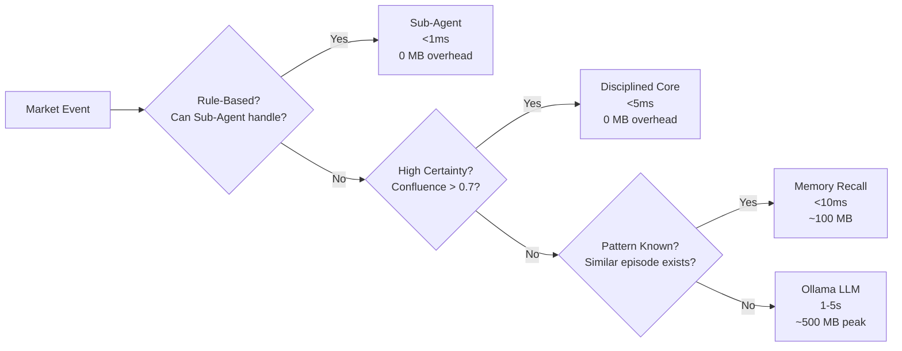
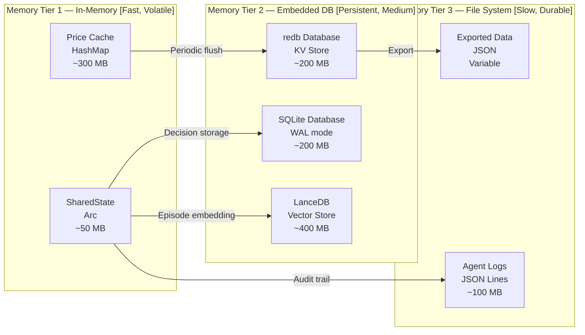

# 💻 tredo Low-Resource Architecture

> **Trading Real-time Edge Decision Optimisation** — 8GB RAM friendly full Terminal UI + autonomous engine.

---

## 🎯 Design Target



---

## 📊 Memory Budget (8GB RAM)



| Component | Memory | % of Budget | Priority |
|-----------|--------|-------------|----------|
| Ollama LLM (ministral-3:3b) | ~3.0 GB | 37.5% | 🔴 Core |
| Kronos Service (Python) | ~1.2 GB | 15.0% | 🔴 Core |
| Rust Runtime + Tokio | ~0.8 GB | 10.0% | 🔴 Core |
| System Reserve | ~0.7 GB | 8.8% | 🟡 Safety |
| Disciplined Core + Agents | ~0.6 GB | 7.5% | 🔴 Core |
| Tauri UI | ~0.5 GB | 6.3% | 🟡 Important |
| Vector Memory (LanceDB) + Hierarchical Recall | ~0.4 GB | 5.0% | 🟡 Important (skills use cheap recall) |
| redb + SQLite Store | ~0.4 GB | 5.0% | 🟢 Efficient (SQLite WAL mode) |
| Price Data Cache | ~0.3 GB | 3.8% | 🟢 Efficient |
| **Total** | **~7.3 GB** | **91.3%** | **✅ 0.7 GB Headroom** |

**Skills & Rules fit:** The new `AgentSkill` implementations (sentiment, vol, trained recall, etc.) and `apply_trained_memory_to_rules` are extremely lightweight (pure computation or fast vector/agentmemory lookups). They add almost zero overhead while giving the "how + memory-adjusted what" on top of the existing low-resource skeleton. Sub-agents stay deterministic and sub-millisecond.

---

## 🧱 Component Architecture



---

## 🚦 LLM Usage Policy

```
LLM is a scarce resource — treated with strict access control.
```

| Condition | Action | Memory Impact |
|-----------|--------|---------------|
| Confluence > 0.7 | ✅ Skip LLM — let rules decide | 0 MB |
| Price at support/resistance | ✅ Skip LLM — deterministic logic | 0 MB |
| Session outside trading hours | ✅ Skip LLM — no trade needed | 0 MB |
| New symbol, no history | ❌ Use LLM for initial assessment | ~500 MB peak |
| High-uncertainty setup | ❌ Use LLM for synthesis | ~500 MB peak |
| Post-trade reflection | ❌ Use LLM for lesson extraction | ~300 MB peak |
| Weekly meta-review | ❌ Use LLM for rule proposals | ~500 MB peak |

### LLM Call Reduction Strategy



---

## ⚡ Performance Benchmarks

| Operation | Time | Memory | LLM Call |
|-----------|------|--------|----------|
| Pivot calculation | <1 ms | 0 KB | ❌ No |
| Confluence scoring | <2 ms | 0 KB | ❌ No |
| Pattern detection (1 TF) | <3 ms | ~50 KB | ❌ No |
| Multi-TF pattern detection (4 TF) | <10 ms | ~200 KB | ❌ No |
| Discipline check (all guards) | <5 ms | 0 KB | ❌ No |
| Position sizing | <1 ms | 0 KB | ❌ No |
| Trade execution (paper) | <10 ms | ~10 KB | ❌ No |
| Episode storage | <5 ms | ~5 KB | ❌ No |
| Vector similarity search | <20 ms | ~200 MB | ❌ No |
| LLM signal generation | 1-5 s | ~500 MB | ✅ Yes |
| Kronos forecast | 100-500 ms | ~200 MB | ❌ No |
| Weekly meta-review | 2-10 s | ~500 MB | ✅ Yes |

**Pipeline timing budget (medium loop, 5-minute interval):**

```mermaid
gantt
    title Pipeline Timing Budget — 5 Minute Window
    axisFormat %S s
    dateFormat HH:mm:ss
    section Perception
    Price Refresh             :active, p1, 00:00:00, 2s
    Pattern Detection         :active, p2, 00:00:02, 10ms
    section Analysis
    Kronos Forecast            :active, a1, 00:00:03, 500ms
    Confluence Scoring         :active, a2, 00:00:04, 2ms
    section Decision
    LLM Signal Generation      :active, d1, 00:00:05, 5s
    Rule Validation             :active, d2, 00:00:10, 5ms
    section Execution
    Paper Trade                 :active, e1, 00:00:11, 10ms
    Episode Storage             :active, e2, 00:00:11, 5ms
    section Idle
    Waiting for next cycle     :active, idle, 00:00:12, 00:04:48
```



**Total active time: ~5.5 seconds out of 300 seconds (1.8% utilization)**

---

## 💾 Data Persistence Strategy



| Store | Type | Persistence | Size Limit | Access Pattern |
|-------|------|-------------|------------|----------------|
| SharedState | Arc<RwLock<HashMap>> | Volatile (in-memory) | ~50 MB | Sub-ms reads, async writes |
| Price Cache | Vec<OhlcvBar> per symbol | Volatile (in-memory) | ~300 MB | 5-second refresh |
| redb | Embedded KV | Persistent (disk) | ~200 MB | Real-time state cache |
| SQLite | Embedded Relational | Persistent (disk) | ~200 MB | Episodic history, regret events, logs, rule changes |
| LanceDB | Vector DB | Persistent (disk) | ~400 MB | Semantic similarity search |
| Agent Logs | JSON Lines file | Persistent (disk) | ~100 MB | Audit trail, debugging |

---

## 🔧 Optimization Techniques

### 1. Lazy LLM Loading
```rust
// LLM executor is only initialized when first needed
pub struct LlmExecutor {
    client: Option<reqwest::Client>, // None until first usage
}
```

### 2. SharedState Arc Pattern
```rust
// All agents share the same state via Arc<RwLock>
// No duplication of data across agent boundaries
pub struct SharedState {
    pub portfolio: Arc<RwLock<PortfolioState>>,
    pub last_signals: Arc<RwLock<Vec<TradeSignal>>>,
    // ...
}
```

### 3. Selective Vector Embedding
- Only embed episodes with `regret_score > 0.3` or `pnl_pct.abs() > 0.02`
- Prune entries older than 90 days from vector store
- Batch embeddings weekly (slow loop) instead of per-trade

### 4. Kronos Service Connection Pooling
- Single `reqwest::Client` shared across all agents
- Reuse HTTP connection with keep-alive
- 600ms timeout with graceful fallback to Neutral trend

### 5. Tauri Frontend Efficiency
- Static HTML/CSS/JS — no build step, no framework overhead
- Canvas-based chart fallback when TradingView widget unavailable
- 3-second polling intervals (not real-time WebSocket for every metric)

---

## 📏 Scaling Guidelines

| Resource | Minimum | Recommended | Maximum |
|----------|---------|-------------|---------|
| RAM | 4 GB | 8 GB | 16 GB |
| CPU Cores | 2 | 4 | 8 |
| Disk (SSD) | 10 GB | 50 GB | 100 GB |
| Network | 10 Mbps | 50 Mbps | 100 Mbps |
| Ollama Model | ministral-3:3b | llama3-8b | llama3-70b |

> **Current target: 8GB RAM, 4 cores, SSD storage** — comfortably within budget with 700MB reserve.
