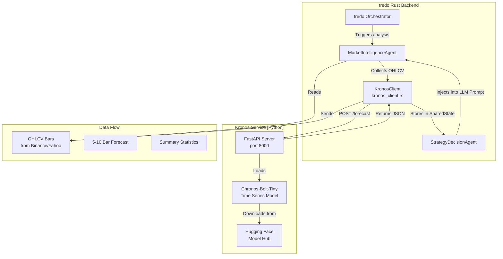
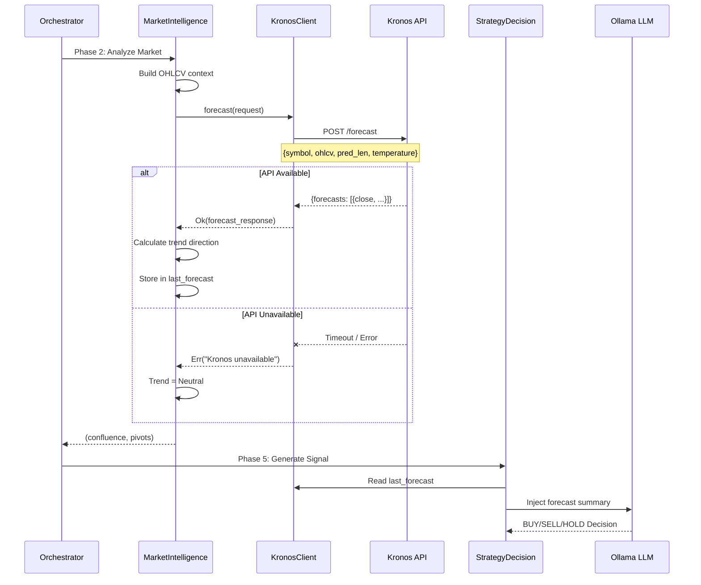
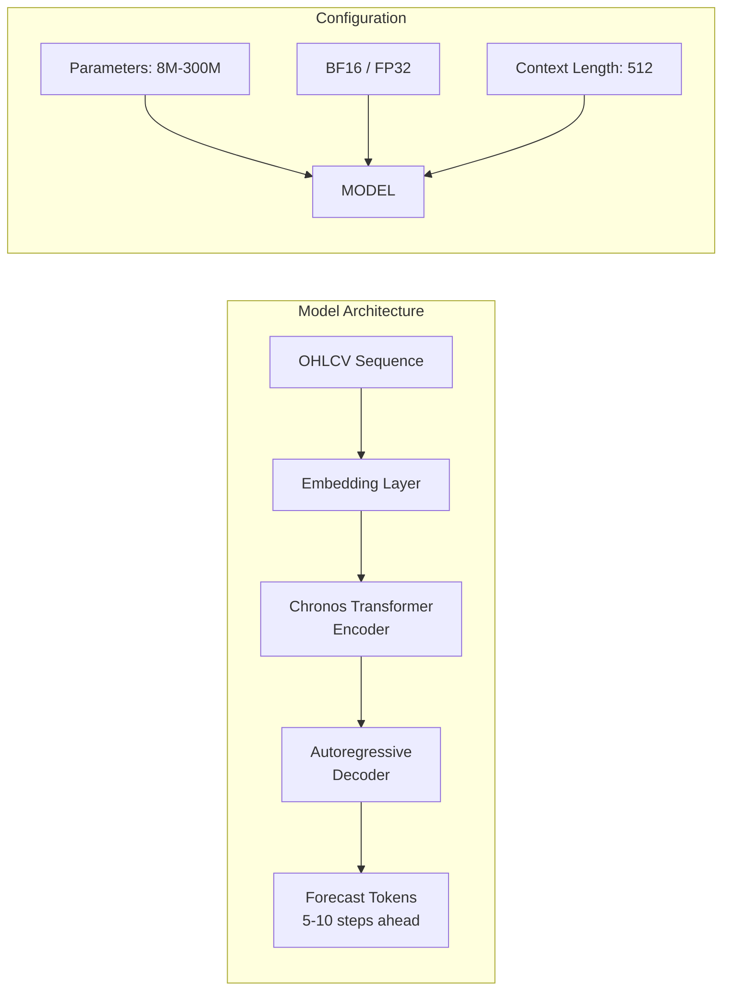

# 🔮 Kronos Forecasting Service

**Lightweight FastAPI microservice** exposing the Kronos foundation model as a REST API for the tredo trading system.

Kronos supplies short-horizon time-series forecasts that enrich market context and strategy decisions. The service is optional — tredo operates with graceful degradation when it is unavailable.

---

## 🏗️ Service Architecture



---

## 🔄 Integration Flow



---

## 📡 API Reference

### `POST /forecast`

Generate a time-series forecast for a given symbol.

**Request:**

```json
{
  "symbol": "NIFTY",
  "ohlcv": [
    {
      "timestamp": "2025-06-12T10:30:00Z",
      "open": 24500.0,
      "high": 24530.0,
      "low": 24480.0,
      "close": 24510.0,
      "volume": 150000.0
    }
  ],
  "pred_len": 10,
  "temperature": 0.8,
  "top_p": 0.9,
  "sample_count": 1
}
```

| Field | Type | Default | Description |
|-------|------|---------|-------------|
| `symbol` | `string` | — | Trading symbol (e.g., NIFTY, BTC, ETH) |
| `ohlcv` | `array` | — | Historical OHLCV bars for context |
| `pred_len` | `int` | 10 | Number of bars to forecast (5-10) |
| `temperature` | `float` | 0.8 | Sampling temperature (0.1-1.0) |
| `top_p` | `float` | 0.9 | Nucleus sampling threshold |
| `sample_count` | `int` | 1 | Number of forecast samples |

**Response:**

```json
{
  "symbol": "NIFTY",
  "forecasts": [
    {
      "close": 24520.5,
      "open": 24512.3,
      "high": 24535.0,
      "low": 24505.0
    }
  ],
  "model": "chronos-bolt-tiny"
}
```

### `GET /health`

Health check endpoint.

**Response:**
```json
{
  "status": "ok",
  "model": "chronos-bolt-tiny",
  "uptime_seconds": 3600
}
```

---

## 🚀 Quick Start

```bash
# 1. Install dependencies
pip install -r requirements.txt

# 2. Start the service (auto-downloads model from Hugging Face)
uvicorn main:app --host 0.0.0.0 --port 8000

# 3. Test it
curl -X POST http://localhost:8000/forecast \
  -H "Content-Type: application/json" \
  -d '{"symbol":"NIFTY","ohlcv":[{"timestamp":"2025-06-12T10:30:00Z","open":24500,"high":24530,"low":24480,"close":24510,"volume":150000}],"pred_len":5}'

# 4. Expected response
# {"symbol":"NIFTY","forecasts":[{"close":24520.5,...}],"model":"chronos-bolt-tiny"}
```

### Offline Mode

For full offline use, pre-download the model:

```bash
# Download Chronos-Bolt-Tiny
huggingface-cli download amazon/chronos-bolt-tiny --local-dir ./models/chronos-bolt-tiny

# Set environment variable for local path
export KRONOS_MODEL_PATH=./models/chronos-bolt-tiny

# Start service
uvicorn main:app --host 0.0.0.0 --port 8000
```

### Using Docker

```bash
docker build -t kronos-service -f kronos_service/Dockerfile .
docker run -p 8000:8000 kronos-service
```

---

## 🧪 Testing

```bash
# Test the service
python -m pytest tests/

# Manual curl test
curl -s http://localhost:8000/health | python -m json.tool

# Performance test (10 concurrent requests)
for i in $(seq 1 10); do
  curl -s -X POST http://localhost:8000/forecast \
    -H "Content-Type: application/json" \
    -d '{"symbol":"NIFTY","ohlcv":[{"timestamp":"2025-06-12T10:30:00Z","open":24500,"high":24530,"low":24480,"close":24510,"volume":150000}],"pred_len":5}' &
done
wait
```

---

## 📊 Model Details



| Property | Value |
|----------|-------|
| **Model** | amazon/chronos-bolt-tiny |
| **Parameters** | ~8M |
| **Context Length** | 512 time steps |
| **Output** | 5-10 step ahead forecast |
| **Precision** | BF16 (default), FP32 fallback |
| **Memory** | ~1.2 GB at inference |
| **Latency** | 100-500ms per request |
| **Framework** | PyTorch + FastAPI |

---

## 🔌 tredo Integration

The Rust side (`tredo-core/src/kronos_client.rs`) calls this service over HTTP.

```rust
// Simplified client code
pub struct KronosForecastTool {
    endpoint: String,
    client: reqwest::Client,
}

impl KronosForecastTool {
    pub async fn forecast(&self, request: KronosForecastRequest) -> Result<KronosForecastResponse> {
        let resp = self.client
            .post(format!("{}/forecast", self.endpoint))
            .json(&request)
            .timeout(Duration::from_millis(5000))
            .send()
            .await?;
        
        let forecasts: KronosForecastResponse = resp.json().await?;
        Ok(forecasts)
    }
}
```

The forecast is used in two places:

1. **MarketIntelligenceAgent** — Determines trend direction (Bullish/Bearish/Neutral) based on forecast vs current price
2. **StrategyDecisionAgent** — Forecast summary is injected into the LLM prompt for informed trade decisions

It also feeds the skills layer (via MI) and debate participants (Proposer/Critic etc. incorporate regime/volatility signals that benefit from accurate short-term forecasts). Part of the overall **Strong Skills + Rules + Trained Memory** intelligence system (see root README and tredo-core/src/skills.rs).

---

## ⚠️ Important Notes

| Note | Details |
|------|---------|
| **First Run** | The model auto-downloads from Hugging Face (~500MB) on first startup |
| **Offline Mode** | Pre-download model and set `KRONOS_MODEL_PATH` for offline use |
| **Memory** | Service uses ~1.2GB RAM during inference |
| **Timeout** | tredo client has a 5-second timeout; service typically responds in 100-500ms |
| **Graceful Degradation** | If Kronos is unavailable, tredo falls back to Neutral trend direction |

---

## 📁 Files

| File | Purpose |
|------|---------|
| `main.py` | FastAPI server with /forecast and /health endpoints |
| `model.py` | Chronos model loading, inference, and forecast generation |
| `download.py` | Hugging Face model download and caching |
| `requirements.txt` | Python dependencies |
| `README.md` | This documentation |
